<html>

<head>
	<meta http-equiv=Content-Type content="text/html; charset=utf-8">
	<meta name=Generator content="Microsoft Word 15 (filtered)">
	<link rel="stylesheet" href="main.css">

</head>

<body lang=EN-US link="#0563C1" vlink="#954F72" style='word-wrap:break-word'>

	

		

		

			<b>
				Filière Sciences Mathématiques et Informatique
				
			</b>
		

		<b>Projet de Fin d’Etudes</b>

		

			<b>
				Semestre S6
				
			</b>
		

		
<b>Mémoire</b>

		

			<b>Gestion de location de voiture
				
			</b>
		

		

			Présenté par :
			
		

		

			<b>
				
				                Bouhrir Ayat                                                  Zerroudi Jalal
				
			</b>
		

		

			
				Encadrant :
			
			<b>Pr.Bennani Mohamed Taj</b>
		

		

			
				Soutenu le : 
			
		

		
Jury&nbsp;:
			

		

			
				Examinateur 1:
				 
				Examinateur 2 : 
				  
				Examinateur 3 :
				 
				Examinateur 4 :
				   
			
		

		

			<b>
				<i>
					
						Année Universitaire 2023/2024
					
				</i>
			</b>
		

		                 
		<h1 align=center style='text-align:center'><a name="_Toc167027324"><b>Remerciements</b></a></h1>

		

			<a name="_Toc166627648">
				<b>
					
						Au nom d’Allah le tout miséricordieux,
					
				</b>
			</a>
		

		

			On tient à adresser
				mes sincères remerciements à mon encadrant, Monsieur 
			
			<b>
				
					Bennani Mohamed Taj , pour son accompagnement précieux tout
				au long de mon projet de fin d'études. Son expertise, ses conseils judicieux et
				son soutien constant ont été essentiels à la réussite de ce travail. Je suis
				profondément reconnaissant pour sa patience et son engagement envers mon
				développement académique et professionnel.
				
			</b>
		

		

			
				Nous tenons également à remercier les membres du jury pour leur évaluation attentive
				de notre travail.
			
		

		
Un merci spécial à
				tous ceux qui ont contribué, directement ou indirectement, à la réalisation de
				ce projet.

		
&nbsp;

		<h1 align=center style='text-align:center'><a name="_Toc167027325"><b>Résumé</b></a></h1>

		
&nbsp;

		
Ce projet de fin d'études présente le
				développement d'une application de bureau innovante, destinée à révolutionner
				la gestion des opérations au sein d'une agence de location de voitures.
				L'objectif principal est de simplifier et d'automatiser l'organisation des
				données, améliorant ainsi l'efficacité et la productivité de l'agence.

		
&nbsp;

		
L'application offre une solution
				complète pour la gestion des réservations, des clients, des véhicules et des
				employés. Elle permet aux employées de gérer facilement les flux de travail
				quotidiens, l'application permet de réduire les erreurs humaines et de
				maximiser l'utilisation des ressources.

		
&nbsp;

		
La phase de conception du projet a
				débuté par une analyse des besoins dans ce secteur, suivie par l'élaboration
				d'une étude conceptuelle et technique. Cette étape préliminaire a été cruciale
				pour définir les spécifications et l'architecture logicielle nécessaires. 

		
&nbsp;

		
Le <b>backend</b> de l’application
				est base sur deux éléments essentiels&nbsp;: le langage de programmation <b>C# </b>et
				<b>MySQL</b> pour la gestion de la base de données.

		
&nbsp;

		
Le <b>frontend</b> utilise <b>Windows
					Presentation Foundation (WPF)</b> avec le framework <b>.NET 8.0</b> pour offrir
				une expérience utilisateur riche et interactive.

		
				

				

					<h1 class="toc-title">Sommaire</h1>
					<ul class="toc-list">
						<li><a href="#_Toc167027324">Remerciements</a></li>
						<li><a href="#_Toc167027325">Résumé</a></li>
						<li><a href="#_Toc167027326">Sommaire</a></li>
						<li><a href="#_Toc167027327">Liste des figures</a></li>
						<li><a href="#_Toc167027328">Liste des Tables</a></li>
						<li><a href="#_Toc167027329">Liste des Acronymes</a></li>
						<li><a href="#_Toc167027330">Introduction Générale</a></li>
						<li><a href="#_Toc167027331">Chapitre 1 : Analyse et cadre général de projet</a>
							<ul>
								<li><a href="#_Toc167027332">INTRODUCTION</a></li>
								<li><a href="#_Toc167027333">Étude de cahier de charge</a>
									<ul>
										<li><a href="#_Toc167027334">Problématique</a></li>
										<li><a href="#_Toc167027335">L’objectif</a></li>
										<li><a href="#_Toc167027336">Solution</a></li>
									</ul>
								</li>
								<li><a href="#_Toc167027337">Analyse des besoins</a>
									<ul>
										<li><a href="#_Toc167027338">Les besoins fonctionnels</a></li>
										<li><a href="#_Toc167027339">Les besoins techniques</a>
											<ul>
												<li><a href="#_Toc167027340">Outils et technologies</a></li>
												<li><a href="#_Toc167027341">Les langages de programmation utilisés</a></li>
												<li><a href="#_Toc167027342">Les cadres applicatifs (Frameworks)</a>
													<ul>
														<li><a href="#_Toc167027343">WPF</a></li>
														<li><a href="#_Toc167027344">NET 8.0</a></li>
														<li><a href="#_Toc167027345">Architecture d’application</a></li>
													</ul>
												</li>
											</ul>
										</li>
									</ul>
								</li>
								<li><a href="#_Toc167027346">Conclusion</a></li>
							</ul>
						</li>
						<li><a href="#_Toc167027347">Chapitre 2 : Conception et modélisation</a>
							<ul>
								<li><a href="#_Toc167027348">Introduction</a></li>
								<li><a href="#_Toc167027349">Gestion de projet</a>
									<ul>
										<li><a href="#_Toc167027350">Cycle de vie</a></li>
										<li><a href="#_Toc167027351">Les modèles du cycle de vie</a>
											<ul>
												<li><a href="#_Toc167027352">Cycle de vie en cascade</a></li>
												<li><a href="#_Toc167027353">Cycle de vie en V</a></li>
											</ul>
										</li>
										<li><a href="#_Toc167027354">Diagramme de Gantt</a></li>
									</ul>
								</li>
								<li><a href="#_Toc167027355">Présentation UML</a>
									<ul>
										<li><a href="#_Toc167027356">Diagramme de cas d’utilisation</a></li>
										<li><a href="#_Toc167027357">Diagramme de classe</a></li>
										<li><a href="#_Toc167027358">Diagramme de séquence</a></li>
									</ul>
								</li>
								<li><a href="#_Toc167027359">Notre projet de location de voiture</a>
									<ul>
										<li><a href="#_Toc167027360">Planification</a></li>
										<li><a href="#_Toc167027361">Cycle de vie en V</a></li>
										<li><a href="#_Toc167027362">Diagramme de Gantt</a></li>
									</ul>
								</li>
							</ul>
						</li>
					</ul>
				

				

				

					<h1 class="toc-title">Liste des Figures</h1>
					<ul class="toc-list">
						<li><a href="#_Toc167031605">Figure 1: Visual Studio logo</a></li>
						<li><a href="#_Toc167031606">Figure 2: Laragon logo</a></li>
						<li><a href="#_Toc167031607">Figure 3: Entreprise Architect logo</a></li>
						<li><a href="#_Toc167031608">Figure 4: MS Project logo</a></li>
						<li><a href="#_Toc167031609">Figure 5: C# logo</a></li>
						<li><a href="#_Toc167031610">Figure 6: MySQL</a></li>
						<li><a href="#_Toc167031611">Figure 7: WPF logo</a></li>
						<li><a href="#_Toc167031612">Figure 8: .NET 8.0 logo</a></li>
						<li><a href="#_Toc167031613">Figure 9: MVVM logo</a></li>
						<li><a href="#_Toc167031614">Figure 10: MSIX logo</a></li>
						<li><a href="#_Toc167031615">Figure 11: Cycle de vie en cascade</a></li>
						<li><a href="#_Toc167031616">Figure 12: Cycle de vie en V</a></li>
						<li><a href="#_Toc167031617">Figure 13: Planification</a></li>
						<li><a href="#_Toc167031618">Figure 14: Cycle de vie en V</a></li>
						<li><a href="#_Toc167031619">Figure 15: Diagramme de GANTT partie 1</a></li>
						<li><a href="#_Toc167031620">Figure 16: Diagramme de GANTT partie 2</a></li>
						<li><a href="#_Toc167031621">Figure 17: Diagramme de cas d’utilisation</a></li>
						<li><a href="#_Toc167031622">Figure 18: Diagramme de classe</a></li>
						<li><a href="#_Toc167031623">Figure 19: Diagramme de séquence (login)</a></li>
						<li><a href="#_Toc167031624">Figure 20: Diagramme de séquence (employé)</a></li>
						<li><a href="#_Toc167031625">Figure 21: Diagramme de séquence (administrateur)</a></li>
						<li><a href="#_Toc167031626">Figure 22: Login</a></li>
						<li><a href="#_Toc167031627">Figure 23: Forget password</a></li>
						<li><a href="#_Toc167031628">Figure 24: Interface d’accueil pour l'administrateur</a></li>
						<li><a href="#_Toc167031629">Figure 25: Interface des voitures pour l'administrateur</a></li>
						<li><a href="#_Toc167031630">Figure 26: Interface des employés pour l'administrateur</a></li>
						<li><a href="#_Toc167031631">Figure 27: Interface de notification pour l'administrateur</a></li>
						<li><a href="#_Toc167031632">Figure 28: Interface d'accueil pour l'employé</a></li>
						<li><a href="#_Toc167031633">Figure 29: Interface client pour l'employé</a></li>
						<li><a href="#_Toc167031634">Figure 30: Interface de réservation pour l'employé</a></li>
						<li><a href="#_Toc167031635">Figure 31: Interface de paiements pour l'employé</a></li>
						<li><a href="#_Toc167031636">Figure 32: Interface de notification pour l'employé</a></li>
					</ul>
				

				

				

					<h1 class="toc-title">Liste des Tables</h1>
					<ul class="toc-list">
						<li><a href="#_Toc167027441">Tableau 1: La liste des acronymes dans le projet</a></li>
						<li><a href="#_Toc167027442">Tableau 2: Table des acteurs</a></li>
					</ul>
				

				

				

					<h1 class="title">Liste des Acronymes</h1>
				
					<table class="acronyms">
						<thead>
							<tr>
								<th>Abréviation</th>
								<th>Désignation</th>
							</tr>
						</thead>
						<tbody>
							<tr>
								<td>UML</td>
								<td>Unified Modeling Language</td>
							</tr>
							<tr>
								<td>C#</td>
								<td>C Sharp</td>
							</tr>
							<tr>
								<td>MySQL</td>
								<td>My Structured Query Language</td>
							</tr>
							<tr>
								<td>MVVM</td>
								<td>Model-View-ViewModel</td>
							</tr>
							<tr>
								<td>.NET 8.0</td>
								<td>Network Enabled Technologies (version 8.0)</td>
							</tr>
							<tr>
								<td>WPF</td>
								<td>Windows Presentation Foundation</td>
							</tr>
							<tr>
								<td>MSIX</td>
								<td>Microsoft Installer for XML</td>
							</tr>
						</tbody>
					</table>
				
					
Tableau 1: la liste des acronymes dans le projet

				

				

				

					<h1 class="title">Introduction Générale</h1>
				
					
La location de voitures est devenue un secteur en pleine expansion, dont la compétitivité augmente jour après jour. Ce service permet aux clients, professionnels ou particuliers, de réserver et prendre un véhicule pour une période donnée, allant de quelques jours à plusieurs mois.

				
					
À l'approche de la COP du Monde en 2030, le Maroc voit affluer de plus en plus de touristes, ce qui augmente la demande pour les agences de voyages et de location de voitures. Pour répondre efficacement aux besoins des visiteurs étrangers, une bonne organisation au niveau des agences de location de voitures est cruciale.

				
					
C’est pourquoi nous nous engageons à réaliser une application de bureau pour gérer les voitures, les employés, les clients et l'administration.

				
					
Le présent rapport synthétise tout le travail que nous avons effectué. Il est composé de plusieurs chapitres :

				
					
<b>Le premier chapitre</b> établit le cadre général du projet en présentant la problématique, les objectifs, la solution envisagée, l'analyse des besoins ainsi que les algorithmes associés.

				
					
<b>Le deuxième chapitre</b> détaille l'analyse fonctionnelle et technique du projet, la conception et les différents diagrammes UML utilisés.

				
					
<b>Le troisième chapitre</b> expose les différentes interfaces de l’application.

				
					
Nous terminons par une conclusion générale.

				

				

				

					<h1 class="chapter-title">Chapitre 1 : Analyse et cadre général de projet</h1>
				
					<!-- Introduction Section -->
					

						<h2 class="section-title">I. INTRODUCTION</h2>
						
Ce chapitre présente le projet de développement d'une application de bureau pour la gestion d'une agence de location de voitures. Nous aborderons les spécifications fonctionnelles et techniques, les défis actuels rencontrés par les agences de location, la solution proposée et un aperçu du planning du projet.

					

				
					<!-- Étude de cahier de charge Section -->
					

						<h2 class="section-title">II. Étude de cahier de charge</h2>
				
						<h3 class="subsection-title">2.1 Problématique</h3>
						
La plupart des agences de location de voiture utilisent la méthode traditionnelle, qui est basée sur des journaux, sans organisation ni hiérarchie. Les documents et les fichiers étant éparpillés rendent ainsi les tâches plus difficiles et engendrent une grande perte de temps et d’argent.

				
						<h3 class="subsection-title">2.2 L’objectif</h3>
						
L'objectif principal de ce projet est de fournir un système complet qui contient une application de bureau permettant d’effectuer les tâches suivantes : gérer les voitures, les employés, les clients et l'administration.

				
						<h3 class="subsection-title">2.3 Solution</h3>
						
Après une étude approfondie, qui a abouti à la conception d'une application de bureau offrant les fonctionnalités standards d'une société de location de voitures, celle-ci promet de simplifier le travail au sein de l'agence. L'application comportera deux espaces distincts : un espace réservé aux employés, leur permettant de gérer les clients, les réservations et les paiements, et un autre espace destiné à l'administrateur, lui donnant accès à la gestion du personnel, des véhicules et de toutes les tâches pouvant être effectuées par ce dernier.

					

					

						<h2 class="section-title">III. Analyse des besoins</h2>
						
Dans la phase d’analyse, on cherche d’abord à bien comprendre et à décrire de façon précise les besoins des utilisateurs de l’application. Que souhaitent-ils faire avec cette application ? Quelles fonctionnalités veulent-ils ? Pour quel usage ? Comment l’action devrait-elle fonctionner ? C’est ce qu’on appelle « l’analyse des besoins ». Il y a deux types de besoins.

						<h3 class="subsection-title">3.1 Les besoins fonctionnels</h3>
						
La solution proposée consiste à réaliser une application desktop qui offre :

							
						

							<ul class="needs-list">
								<li>
									<b>Gestion des clients :</b>
									<ul>
										<li>Voir les voitures disponibles.</li>
										<li>Réserver, signer un contrat et payer.</li>
									</ul>
								</li>
								<li>
									<b>Gestion des voitures :</b>
									<ul>
										<li>Enregistrement des informations sur les véhicules (numéro de matricule, couleur, équipements, type…) est une tâche effectuée par l'administrateur.</li>
									</ul>
								</li>
								<li>
									<b>Gestion des employés :</b>
									<ul>
										<li>Renseigner le client.</li>
										<li>Voir la disponibilité, établir, vérifier les réservations.</li>
										<li>Confirmer une réservation.</li>
										<li>Valider le paiement.</li>
									</ul>
								</li>
								<li>
									<b>Gestion d'administration :</b>
									<ul>
										<li>Enregistrement des informations des employés et des voitures (Ajouter, modifier, supprimer).</li>
										<li>Maintenance des voitures.</li>
									</ul>
								</li>
							</ul>
						

						<h3 class="subsection-title">3.2 Les besoins techniques</h3>
						
La solution technique proposée doit inclure les éléments suivants :

						

						

							<ul class="needs-list">
								<li>
									<b>Outils et technologies :</b>
									<ul>
										<li>
											<b>Visual Studio :</b>
											
Un environnement de développement intégré (IDE) avancé de Microsoft, conçu pour le développement sur Windows et .NET.

										</li>
										<li>
											<b>Laragon :</b>
											
Une plateforme de développement web locale facilitant la gestion des environnements de développement pour les projets web.

										</li>
										<li>
											<b>Enterprise Architect :</b>
											
Un outil de modélisation UML pour la conception et la modélisation des systèmes d'information et logiciels.

										</li>
										<li>
											<b>Microsoft Office Project :</b>
											
Un logiciel de gestion de projet permettant de planifier, suivre et gérer des projets de diverses tailles et complexités.

										</li>
									</ul>
								</li>
								<li>
									<b>Langages de programmation utilisés :</b>
									<ul>
										<li>
											<b>Visual Basic .Net :</b>
											
Un langage orienté objet utilisé principalement pour le développement d'applications Windows et services web.

										</li>
										<li>
											<b>C# :</b>
											
Un langage polyvalent pour le développement d'applications Windows, services web, applications mobiles, et jeux.

										</li>
										<li>
											<b>HTML :</b>
											
Le langage standard pour créer et structurer les pages web et applications web.

										</li>
										<li>
											<b>JavaScript :</b>
											
Un langage de programmation pour ajouter de l'interactivité aux pages web et créer des fonctionnalités dynamiques côté client.

										</li>
										<li>
											<b>SQL :</b>
											
Un langage pour gérer et manipuler des bases de données relationnelles, permettant la création, lecture, mise à jour, et suppression des données.

										</li>
									</ul>
								</li>
							</ul>
						

						
	
					

				

				

				

					<h1 class="chapter-title">Chapitre 2 : Conception et modélisation</h1>
					

						<h2 class="section-title">I. Introduction</h2>
						

							Dans ce chapitre, nous aborderons les fondamentaux de la gestion de projet et du développement logiciel, en mettant un accent particulier sur l'analyse et la conception de systèmes.
						

					

					

						<h2 class="section-title">II. Gestion de projet</h2>
						
						

							La Gestion de projet est indispensable aux professionnelles, elle joue un rôle de plus en plus déterminant au quotidien dans toutes les activités professionnelles. Chaque année, les entreprises ont de nombreux challenges à relever :
						

					
						<ul style="margin-left: 0.75in; text-indent: 16.8pt;">
							<li>Lancement de nouveaux services ou produits innovants (développement d'un nouveau logiciel par exemple).</li>
							<li>Mise à jour de technologies déjà implantées pour rester compétitif.</li>
							<li>Adaptation à des contraintes légales nationales ou internationales.</li>
						</ul>
					
						<h3 class="subsection-title" id="cycle-de-vie">2.1 Cycle de vie</h3>
						

							<b>Cycle de vie (lifecycle)</b> désigne la période de naissance d’un logiciel à sa mise hors service définitive, en passant par sa construction et son utilisation. La vie d’un logiciel est composée de différentes étapes. La succession de ces étapes forme le cycle de vie du logiciel. Il faut contrôler la succession de ces différentes étapes.
						

					
						<h3 class="subsection-title" id="modeles-du-cycle-de-vie">2.2 Les modèles du cycle de vie</h3>
					
						<h4 class="subsubsection-title" id="cycle-de-vie-en-cascade">a. Cycle de vie en cascade</h4>
						

							C’est le modèle le plus simple, il se caractérise par un déroulement de phases successives. Il est adapté pour des projets de petite taille, et dont le domaine est bien maîtrisé.
						

						

							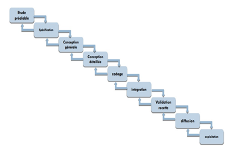
						

						

							Figure 11 : Cycle de vie en cascade
						

					
						<h4 class="subsubsection-title" id="cycle-de-vie-en-v">b. Cycle de vie en V</h4>
						

							Le modèle du cycle en V est un modèle imaginé suite au problème de réactivité du modèle en cascade. Il permet, en cas d'anomalie, de limiter un retour aux étapes précédentes. Les phases de la partie montante doivent renvoyer de l'information sur les phases en vis-à-vis lorsque des défauts sont détectés, afin d'améliorer le logiciel. C’est en phase de spécification que l’on se préoccupe des procédures de validation. C’est en phase de conception générale que l’on se préoccupe des procédures d’intégration. C’est en phase de conception détaillée que l’on prépare les tests unitaires. Il est adapté pour des projets dont le domaine est bien maîtrisé.
						

						

							
						

						

							Figure 12 : Cycle de vie en V
						

					
						<h3 class="subsection-title" id="diagramme-de-gantt">2.3 Diagramme de Gantt</h3>
						

							Le <b>diagramme de Gantt</b> est une méthode de représentation graphique qui illustre le calendrier des phases, activités, tâches, et ressources d'un projet. Sur l'axe horizontal, on positionne les jours, semaines ou mois, tandis que l'axe vertical liste les différentes tâches. Chaque tâche est représentée par une barre, dont la longueur correspond à sa durée estimée.
						

						

							Les tâches peuvent se suivre ou se dérouler simultanément, en totalité ou partiellement. Créé par Henry L. Gantt en 1917, ce diagramme demeure aujourd'hui l'un des outils les plus couramment utilisés pour la gestion de projet.
						

					

					

					

						<h2>
							
							
							<a name="_Toc167027355">
								III. Présentation UML
							</a>
						</h2>
					
						
<b>UML (Unified Modeling Language)</b> est un langage graphique standard de modélisation utilisé pour représenter des systèmes logiciels. Il offre une méthode normalisée pour visualiser la conception d'un système en utilisant différents types de diagrammes.

					
						<h4>
							
							
							<a name="_Toc167027356">
								a. Diagramme de cas d’utilisation
							</a>
						</h4>
						

							Le <b>diagramme de cas d'utilisation</b> est un outil de modélisation essentiel qui illustre les interactions entre les utilisateurs et un système. Il organise les fonctionnalités du système en cas d'utilisation, qui sont des unités logiques décrivant des actions spécifiques que les utilisateurs peuvent réaliser avec le système. Chaque cas d'utilisation capture un besoin utilisateur, offrant une vue centrée sur l'utilisateur plutôt qu'une approche technique.
						

						
<b>Composants Principaux :</b>

						<ul>
							<li><b>Acteurs :</b> Les utilisateurs ou autres systèmes qui interagissent avec le système.</li>
							<li><b>Cas d'utilisation :</b> Les fonctionnalités spécifiques du système, pertinentes pour les acteurs.</li>
							<li><b>Relations :</b> Les connexions entre les cas d'utilisation qui montrent comment ils sont liés ou dépendent les uns des autres.</li>
						</ul>
						

							Les diagrammes de cas d'utilisation sont essentiels pour s'assurer que le développement informatique répond précisément aux attentes des utilisateurs. Ils jouent un rôle crucial en garantissant la fonctionnalité et l'efficacité du système final.
						

					
						<h4>
							
							
							<a name="_Toc167027357">
								b. Diagramme de classe
							</a>
						</h4>
						

							<b>Un diagramme de classe</b> est un type de diagramme structurel utilisé en génie logiciel pour décrire la structure statique d'un système. Il montre les classes du système, leurs propriétés, et les relations entre elles. Cela inclut la visualisation des interactions comme les associations, les héritages, et les dépendances.
						

						
<b>Composants Principaux :</b>

						<ul>
							<li><b>Classes :</b> Représentées par des rectangles, les classes comprennent trois parties :
								<ul>
									<li><b>Nom de la Classe :</b> Le titre de la classe, souvent un nom de substantif.</li>
									<li><b>Attributs :</b> Variables ou propriétés stockées dans la classe.</li>
									<li><b>Méthodes :</b> Fonctions ou procédures que la classe peut exécuter.</li>
								</ul>
							</li>
							<li><b>Relations :</b>
								<ul>
									<li><b>Association :</b> Une connexion générale entre deux classes, représentée par une ligne.</li>
									<li><b>Agrégation :</b> Une forme spéciale d'association qui représente une relation "tout-partie", marquée par un diamant blanc à une extrémité de la ligne.</li>
									<li><b>Composition :</b> Une forme plus forte d'agrégation avec un diamant noir, indiquant une possession exclusive.</li>
									<li><b>Héritage :</b> Représenté par une flèche pointue, indiquant une relation de type "est-un".</li>
								</ul>
							</li>
							<li><b>Visibilité :</b> Indique si les attributs ou méthodes sont accessibles depuis d'autres classes, souvent noté par des symboles (+, -, #).</li>
						</ul>
					
						<h4>
							
							
							<a name="_Toc167027358">
								c. Diagramme de séquence
							</a>
						</h4>
						

							<b>Le diagramme de séquence</b> est un outil crucial en génie logiciel, relevant des diagrammes comportementaux et plus spécifiquement des diagrammes d'interactions. Il est utilisé pour représenter les interactions entre les différents objets et acteurs d'un système informatique, montrant comment ils communiquent entre eux au fil du temps.
						

						
<b>Composants Principaux :</b>

						<ul>
							<li><b>Lignes de Vie :</b> Représentées par des lignes verticales qui descendent des entêtes des objets ou acteurs, elles indiquent la présence de l'objet au fil du temps.</li>
							<li><b>Barres d'Activation :</b> Des rectangles fins sur les lignes de vie qui montrent quand un objet est actif dans le processus.</li>
							<li><b>Messages :</b> Flèches horizontales qui montrent les interactions entre les objets, avec des annotations pour décrire l'action ou la méthode appelée.</li>
						</ul>
					

					

				

		<h2 style='margin-left:50.15pt;text-indent:-.5in'><a
				name="_Toc167027359">IV.&nbsp;&nbsp;&nbsp;&nbsp;&nbsp;&nbsp;&nbsp;&nbsp;&nbsp;&nbsp;&nbsp;
					Notre projet de location de
					voiture</a>&nbsp;</h2>

		<h2 style='margin-left:.75in;text-indent:0in'>&nbsp;</h2>

		<h3 style='margin-left:1.0in;text-indent:-.25in'><a name="_Toc167027360">a.&nbsp;&nbsp;&nbsp;&nbsp;&nbsp;
					Planification</a></h3>

		
<b>&nbsp;</b>

		

		
<a name="_Toc167031617">Figure
				</a>13 : Planification

		
<b>&nbsp;</b>

		<h3 style='margin-left:1.0in;text-indent:-.25in'><a name="_Toc167027361">b.&nbsp;&nbsp;&nbsp;&nbsp;
					Cycle de vie
					en V</a>&nbsp;</h3>

		
<b>&nbsp;</b>

		
Nous avons choisi le cycle en V. Car ce modèle
					est caractérisé par le parallélisme, dans ce modèle verticalement nous trouvons
					les étapes du développement et horizontalement la vérification.

		

		
<a name="_Toc167031618">Figure
				</a>14: Cycle de vie en v

		<h3 style='margin-left:1.0in;text-indent:-.25in'><a name="_Toc167027362">c.&nbsp;&nbsp;&nbsp;&nbsp;&nbsp;
					Diagramme de
					Gantt</a></h3>

		<h3 style='margin-left:1.0in'>&nbsp;</h3>

		

		
<a name="_Toc167031619">Figure
				</a>15 : Diagramme de GANTT partie1

		
<b>&nbsp;</b>

		

		
<a name="_Toc167031620">Figure
				</a>16: Diagramme de GANTT partie2

		<h3 style='margin-left:1.0in;text-indent:-.25in'><a name="_Toc167027363">d.&nbsp;&nbsp;&nbsp;&nbsp;
					Modélisation</a></h3>

		<h3 style='margin-left:1.0in'>&nbsp;</h3>

		<h4 style='margin-left:88.8pt;text-indent:-.25in'><a name="_Toc167027364"><b>1)&nbsp;&nbsp;&nbsp;&nbsp;&nbsp;
						</b><b>Les
						acteurs</b></a></h4>

		
&nbsp;

		
Identification des
				acteurs et leur rôle :

		
&nbsp;

		<table class=MsoTable15Plain1 border=1 cellspacing=0 cellpadding=0 width=605
			style='width:453.4pt;margin-left:27.9pt;border-collapse:collapse;border:none'>
			<tr style='height:26.9pt'>
				<td width=340 valign=top style='width:255.2pt;border:solid #BFBFBF 1.0pt;padding:0in 5.4pt 0in 5.4pt;height:26.9pt'>
					
<b>Acteurs</b>

				</td>
				<td width=264 valign=top style='width:198.2pt;border:solid #BFBFBF 1.0pt;border-left:none;padding:0in 5.4pt 0in 5.4pt;height:26.9pt'>
					
<b>Rôle</b>

				</td>
			</tr>
			<tr style='height:41.95pt'>
				<td width=340 valign=top style='width:255.2pt;border:solid #BFBFBF 1.0pt;border-top:none;background:#F2F2F2;padding:0in 5.4pt 0in 5.4pt;height:41.95pt'>
					
&nbsp;

					
<b>Administrateur</b>

				</td>
				<td width=264 valign=top style='width:198.2pt;border-top:none;border-left:none;border-bottom:solid #BFBFBF 1.0pt;border-right:solid #BFBFBF 1.0pt;background:#F2F2F2;padding:0in 5.4pt 0in 5.4pt;height:41.95pt'>
					
&nbsp;

					
·&nbsp;&nbsp;&nbsp;&nbsp;&nbsp;&nbsp;&nbsp;&nbsp;
							Gérer les voitures

					
·&nbsp;&nbsp;&nbsp;&nbsp;&nbsp;&nbsp;&nbsp;&nbsp;
							Gérer les employées

					
&nbsp;

				</td>
			</tr>
			<tr style='height:65.9pt'>
				<td width=340 valign=top style='width:255.2pt;border:solid #BFBFBF 1.0pt;border-top:none;padding:0in 5.4pt 0in 5.4pt;height:65.9pt'>
					
&nbsp;

					
<b>Employé</b>

				</td>
				<td width=264 valign=top style='width:198.2pt;border-top:none;border-left:none;border-bottom:solid #BFBFBF 1.0pt;border-right:solid #BFBFBF 1.0pt;padding:0in 5.4pt 0in 5.4pt;height:65.9pt'>
					
&nbsp;

					
·&nbsp;&nbsp;&nbsp;&nbsp;&nbsp;&nbsp;&nbsp;&nbsp;
							Gérer les clients

					
·&nbsp;&nbsp;&nbsp;&nbsp;&nbsp;&nbsp;&nbsp;&nbsp;
							Gérer les réservations

					
·&nbsp;&nbsp;&nbsp;&nbsp;&nbsp;&nbsp;&nbsp;&nbsp;
							Gérer les paiements

					
&nbsp;

				</td>
			</tr>
			<tr style='height:40.4pt'>
				<td width=340 valign=top style='width:255.2pt;border:solid #BFBFBF 1.0pt;border-top:none;background:#F2F2F2;padding:0in 5.4pt 0in 5.4pt;height:40.4pt'>
					
&nbsp;

					
<b>Client</b>

					
<b>&nbsp;</b>

				</td>
				<td width=264 valign=top style='width:198.2pt;border-top:none;border-left:none;border-bottom:solid #BFBFBF 1.0pt;border-right:solid #BFBFBF 1.0pt;background:#F2F2F2;padding:0in 5.4pt 0in 5.4pt;height:40.4pt'>
					
&nbsp;

					
·&nbsp;&nbsp;&nbsp;&nbsp;&nbsp;&nbsp;&nbsp;&nbsp;
							Voir les voitures disponibles

					
·&nbsp;&nbsp;&nbsp;&nbsp;&nbsp;&nbsp;&nbsp;&nbsp;
							Faire une réservation

					
&nbsp;

				</td>
			</tr>
		</table>

		
<a name="_Toc167027442"><b>Tableau
					</b></a><b>2</b><b>: table des
					acteurs</b>

		
&nbsp;

		<h4 style='margin-left:88.8pt;text-indent:-.25in'><a name="_Toc167027365"><b>2)&nbsp;&nbsp;&nbsp;&nbsp; </b><b>Diagramme
						de cas d’utilisation</b></a></h4>

		
<b>&nbsp;</b>

		
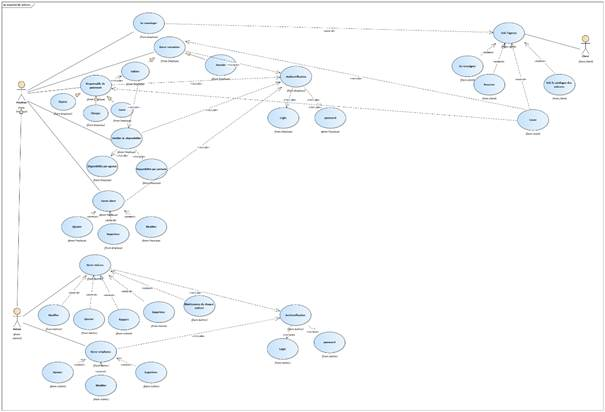

		
<a name="_Toc167031621">Figure
				</a>17 : Diagramme de cas d’utilisation

		
&nbsp;

		
<b>&nbsp;</b>

		<h4><b>&nbsp;</b></h4>

		
&nbsp;

		<h4 style='margin-left:88.8pt;text-indent:-.25in'><a name="_Toc167027366"><b>3)&nbsp;&nbsp;&nbsp;&nbsp; </b><b>Diagramme de
						classe</b></a></h4>

		
<b>&nbsp;</b>

		

		
<a name="_Toc167031622">Figure
				</a>18 :Diagramme de classe

		
<b>&nbsp;</b>

		
&nbsp;

		 
		

		
&nbsp;

		<h4 style='margin-left:88.8pt;text-indent:-.25in'><a name="_Toc167027367"><b>4)&nbsp;&nbsp;&nbsp;&nbsp; </b><b>Diagramme
						de</b></a><b> séquence</b></h4>

		
&nbsp;

		
<b><u>Pour login</u></b>

		
                        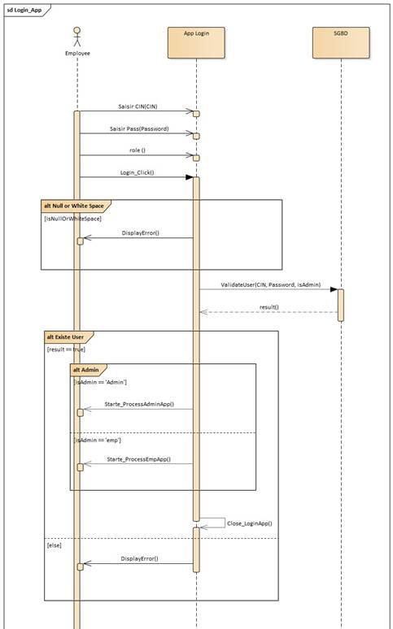

		
            

		
                                 

		
<a name="_Toc167031623">Figure
				</a>19 : diagramme de  séquence(login)

		
<b><u>Pour employer</u></b>

		
<b>&nbsp;</b>

		
<b>                        </b>

		
&nbsp;

		
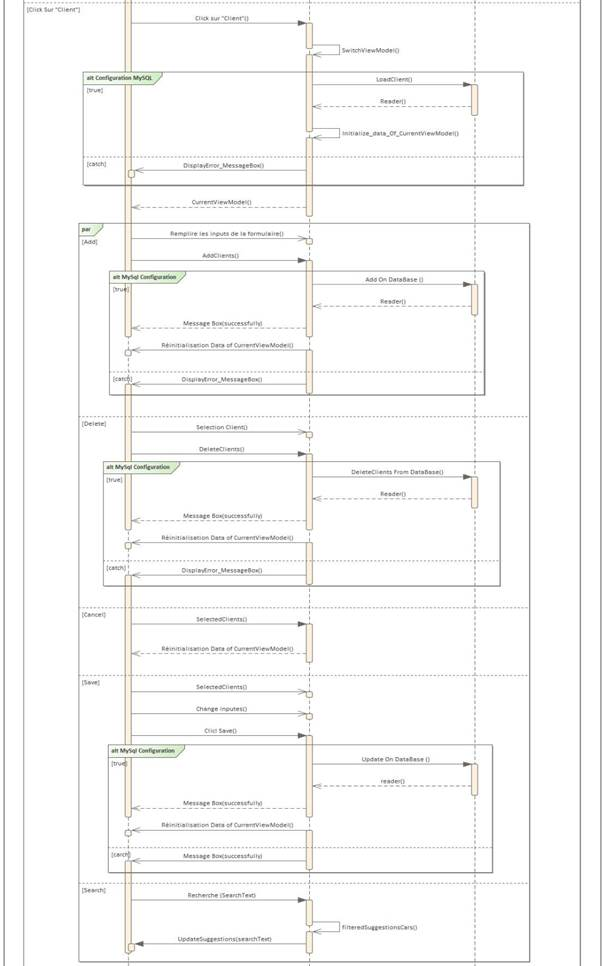
		

		
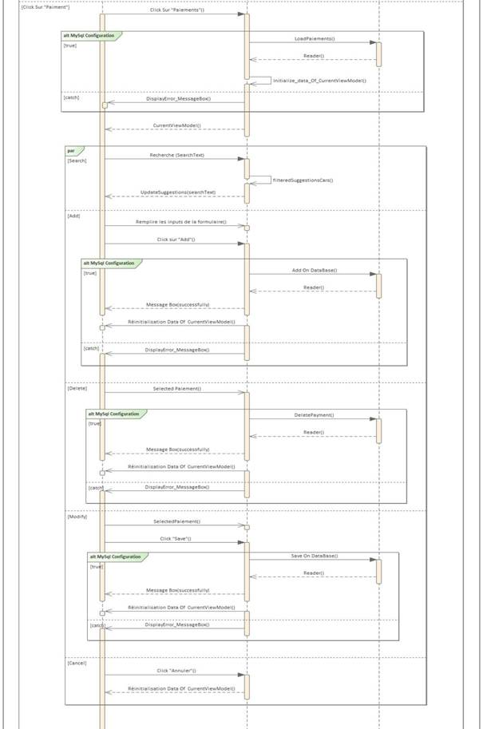
		

		
&nbsp;

		
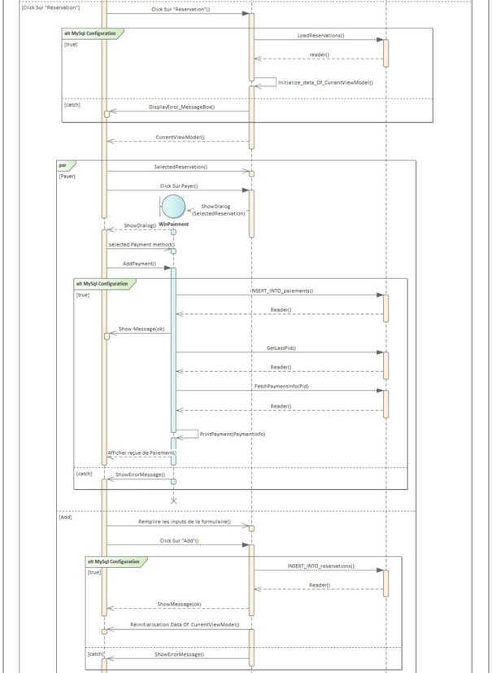
		

		
            

		

		
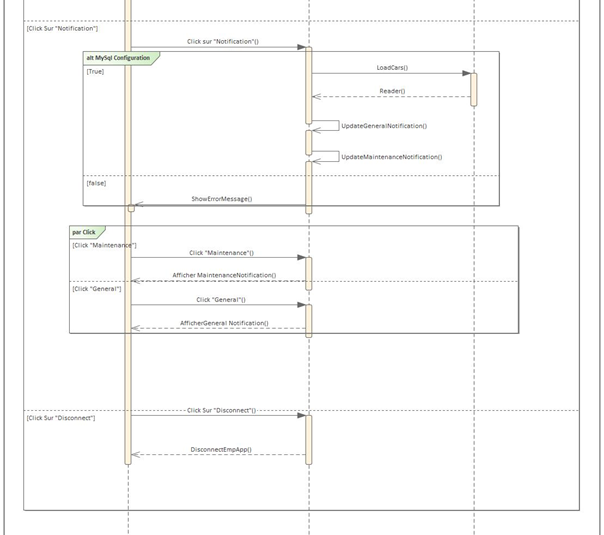
		

		
<a name="_Toc167031624">Figure
				</a>20: diagramme de séquence (employer)

		
&nbsp;

		
<b><u>Pour l’administrateur</u></b>

		
<b>                                    </b>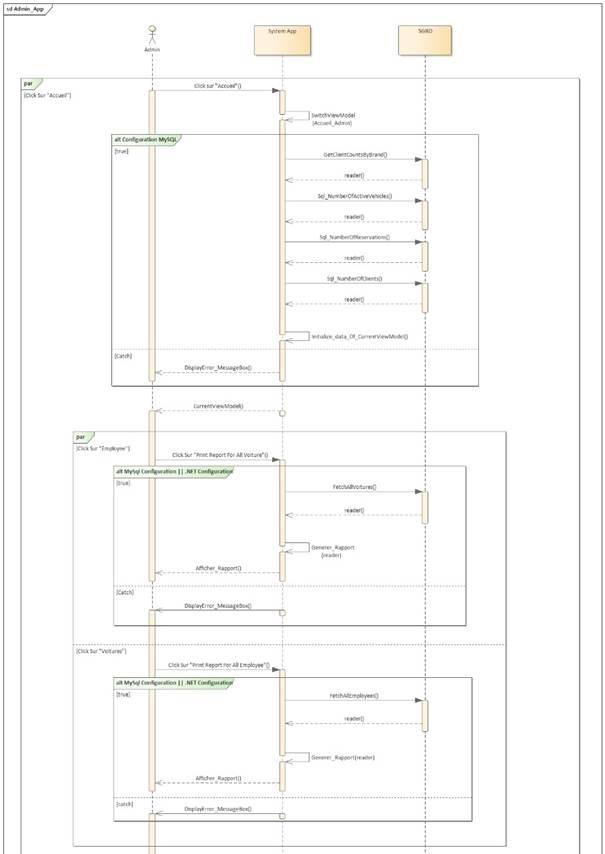

		
<b>&nbsp;</b>

		
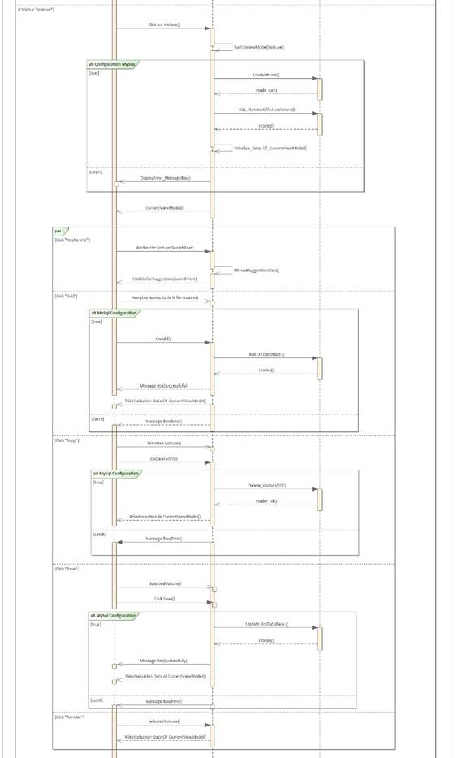

		
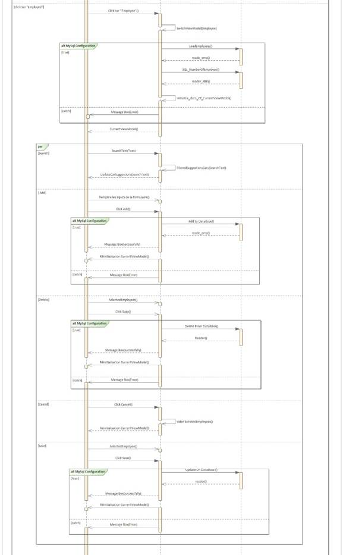

		
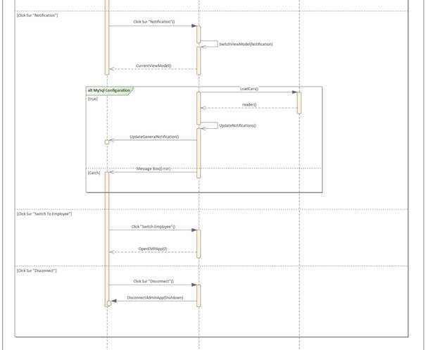

		
<a name="_Toc167031625">Figure
				</a>21 : diagramme de séquence (administrateur)

		
<b>&nbsp;</b>

		<h2 style='margin-left:50.15pt;text-indent:-.5in'><a
				name="_Toc167027368">V.&nbsp;&nbsp;&nbsp;&nbsp;&nbsp;&nbsp;&nbsp;&nbsp;&nbsp;&nbsp;&nbsp;&nbsp;&nbsp;&nbsp;
					Conclusion</a></h2>

		<h2 style='margin-left:.75in;text-indent:0in'>&nbsp;</h2>

		
Dans ce chapitre,
				nous avons développé les divers composants de notre système. Le chapitre
				suivant sera consacré à la mise en œuvre de notre modèle.

		
<b>&nbsp;</b>

		
<b>                                    </b>

		 
		

		
&nbsp;

		<h1 align=center style='text-align:center'><a
				name="_Toc167027369"><b>Chapitre 3 : Réalisation du
						projet</b></a></h1>

		
&nbsp;

		<h2 style='margin-left:.75in;text-indent:-.5in'><a
				name="_Toc167027370">I.&nbsp;&nbsp;&nbsp;&nbsp;&nbsp;&nbsp;&nbsp;&nbsp;&nbsp;&nbsp;&nbsp;&nbsp;&nbsp;&nbsp;&nbsp;&nbsp;&nbsp;
					Introduction</a> </h2>

		<h2 style='margin-left:.75in;text-indent:0in'>&nbsp;</h2>

		
La phase de
				réalisation est une étape très importante dans le cycle de vie de nos
				applications, cette phase permet de concrétiser notre projet par le
				développement des interfaces et par des réalisations concrètes des
				fonctionnalités du système. Pour réaliser ces applications nous avons en
				recourt à plusieurs outils de développement. Dans cette dernière partie on va
				présenter le résultat final de notre application.

		<h2 style='margin-left:.75in;text-indent:0in'>&nbsp;</h2>

		<h2 style='margin-left:.75in;text-indent:-.5in'><a
				name="_Toc167027371">II.&nbsp;&nbsp;&nbsp;&nbsp;&nbsp;&nbsp;&nbsp;&nbsp;&nbsp;&nbsp;&nbsp;&nbsp;&nbsp;
					Application Desktop</a></h2>

		<h2 style='margin-left:.75in;text-indent:0in'>&nbsp;</h2>

		<h3><a name="_Toc167027372">2.1 Les
					interfaces et les explications</a></h3>

		
<b>&nbsp;</b>

		<h4 style='margin-left:88.8pt;text-indent:-.25in'><a name="_Toc167027373"><b>1)&nbsp;&nbsp;&nbsp;&nbsp;&nbsp;
						</b><b>Authentification</b></a>
		</h4>

		
<b>&nbsp;</b>

		
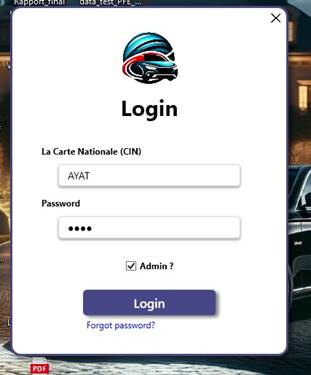

		
<a name="_Toc167031626">Figure
				</a>22 : login

		
<b>&nbsp;</b>

		
L'interface
				d'authentification constitue la première étape d'interaction entre
				l'utilisateur et notre application de bureau.

		<h4 style='margin-left:88.8pt;text-indent:-.25in'><a name="_Toc167027374"><b>2)&nbsp;&nbsp;&nbsp;&nbsp; </b><b>Interface
						Forget password</b></a></h4>

		
&nbsp;

		

		
<a name="_Toc167031627">Figure
				</a>23 : forget password

		
&nbsp;

		
L'interface de
				récupération de mot de passe est une partie essentielle de notre application de
				bureau. Elle aide les utilisateurs à récupérer leur accès s'ils oublient leurs
				identifiants.

		<h4>&nbsp;</h4>

		
&nbsp;

		
&nbsp;

		<h4 style='margin-left:88.8pt;text-indent:-.25in'><a name="_Toc167027375"><b>3)&nbsp;&nbsp;&nbsp;&nbsp; </b><b>Les
						interfaces d’administrateur</b></a></h4>

		<h5>&nbsp;</h5>

		<h5 style='margin-left:88.8pt;text-indent:-.25in'><a name="_Toc167027376"><b>a.&nbsp;&nbsp;&nbsp;&nbsp;&nbsp;
						</b><b>Interface
						accueil</b></a></h5>

		
&nbsp;

		

		
<a name="_Toc167031628">Figure
				</a>24 :  interface d’accueil pour l'administrateur

		
&nbsp;

		
L'interface
				d'accueil pour l'administrateur fournit un aperçu complet des véhicules sortis,
				des réservations effectuées et du nombre de clients enregistrés dans la base de
				données. Elle présente des graphiques illustrant le nombre de clients par
				marque, ainsi que divers indicateurs clés. De plus, elle offre des options pour
				imprimes des rapports sur les voitures et les employés.

		
<b>&nbsp;</b>

		<h5 style='margin-left:88.8pt;text-indent:-.25in'><a name="_Toc167027377"><b>b.&nbsp;&nbsp;&nbsp;&nbsp; </b><b>Interface
						voiture</b></a></h5>

		

		
<a name="_Toc167031629">Figure
				</a>25 :  interface des voitures pour l'administrateur
		

		
L'interface
				des voitures pour l'administrateur affiche le nombre total de véhicules
				enregistrés dans la base de données. Elle propose également des fonctionnalités
				permettant d'ajouter une nouvelle voiture, ainsi que de modifier ou supprimer
				les entrées existantes, facilitant ainsi la gestion complète des voitures.

		
<b>&nbsp;</b>

		<h5 style='margin-left:88.8pt;text-indent:-.25in'><a name="_Toc167027378"><b>c.&nbsp;&nbsp;&nbsp;&nbsp;&nbsp;
						</b><b>Interface
						employée</b></a></h5>

		
<b>&nbsp;</b>

		

		
<a name="_Toc167031630">Figure
				</a>26 : interface des employés pour l'administrateur
		

		
&nbsp;

		
L'interface des
				employés pour l'administrateur affiche le nombre total d'employés enregistrés
				dans la base de données. Elle propose également des fonctionnalités permettant
				d'ajouter un nouvel employé, ainsi que de modifier ou supprimer les entrées
				existantes, facilitant ainsi la gestion complète du personnel.

		
<b>&nbsp;</b>

		<h5 style='margin-left:88.8pt;text-indent:-.25in'><a name="_Toc167027379"><b>d.&nbsp;&nbsp;&nbsp;&nbsp; </b><b>Interface
						notification</b></a></h5>

		
<b>&nbsp;</b>

		

		
<a name="_Toc167031631">Figure
				</a>27 :  interface de notification pour
				l'administrateur

		
<b>&nbsp;</b>

		
&nbsp;

		
L'interface de
				notification indique, sous l'onglet &quot;Général&quot;, les véhicules
				disponibles pour la location. Dans l'onglet &quot;Maintenance&quot;, elle
				affiche des alertes pour les véhicules qui requièrent une maintenance. Cette
				fonctionnalité assure une gestion efficace du parc automobile en offrant des
				mises à jour en temps réel sur l'état des véhicules, facilitant ainsi
				l'organisation de la location et de la maintenance des voitures.

		
<b>&nbsp;</b>

		<h4 style='margin-left:88.8pt;text-indent:-.25in'><a name="_Toc167027380"><b>4)&nbsp;&nbsp;&nbsp;&nbsp; </b><b>Les
						interfaces d’employée</b></a></h4>

		
<b>&nbsp;</b>

		<h5 style='margin-left:106.8pt;text-indent:-.25in'><a name="_Toc167027381"><b>a.&nbsp;&nbsp;&nbsp;&nbsp;&nbsp;
						</b><b>Interface
						accueil</b></a></h5>

		
<b>&nbsp;</b>

		

		
<a name="_Toc167031632">Figure
				</a>28 :  interface d'accueil pour l'employé

		
<b>&nbsp;</b>

		
&nbsp;

		
L'interface
				d'accueil pour l'employé présente un résumé détaillé des réservations
				effectuées et du total de clients enregistrés dans la base de données. Un
				graphique y illustre le nombre de clients ayant loué une ou plusieurs voitures
				chaque mois, accompagné d'autres indicateurs clés. De plus, cette interface
				offre la possibilité d'imprimer des rapports approfondis sur les clients et les
				réservations.

		
<b>&nbsp;</b>

		
<b>&nbsp;</b>

		<h5 style='margin-left:106.8pt;text-indent:-.25in'><a name="_Toc167027382"><b>b.&nbsp;&nbsp;&nbsp;&nbsp; </b><b>Interface
						client</b></a></h5>

		
<b>&nbsp;</b>

		

		
<a name="_Toc167031633">Figure
				</a>29 : interface client pour l'employé

		
&nbsp;

		
L'interface client
				affiche le nombre total de clients enregistrés dans la base de données. Elle
				offre également des options pour ajouter, modifier ou supprimer des clients,
				facilitant ainsi la gestion efficace de la clientèle. Cette interface
				centralise les informations client, améliorant l'organisation et la
				communication au sein de l'entreprise.

		
<b>&nbsp;</b>

		
<b>&nbsp;</b>

		<b> 
			</b>

		
<b>&nbsp;</b>

		<h5 style='margin-left:106.8pt;text-indent:-.25in'><a name="_Toc167027383"><b>c.&nbsp;&nbsp;&nbsp;&nbsp;&nbsp;
						</b><b>Interface
						réservation</b></a></h5>

		
<b>&nbsp;</b>

		
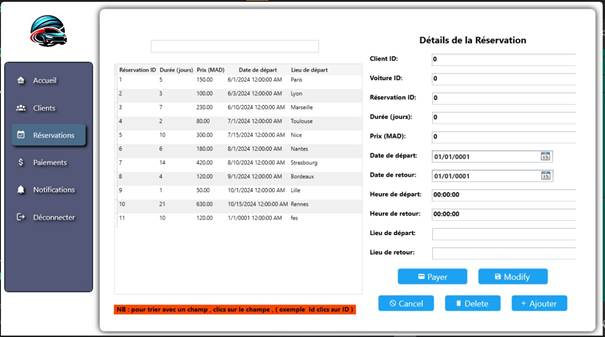

		
<a name="_Toc167031634">Figure
				</a>30 :  interface de réservation pour l'employé

		
<b>&nbsp;</b>

		
&nbsp;

		
<a name="_Hlk167026238">L'interface de réservation permet d'ajouter, de modifier ou de
					supprimer des réservations, simplifiant ainsi leur gestion. Elle centralise
					toutes les informations relatives aux réservations, ce qui contribue à améliorer
					l'organisation et la communication dans l'entreprise.</a>

		
<b>&nbsp;</b>

		
<b>&nbsp;</b>

		<b> 
			</b>

		
<b>&nbsp;</b>

		<h5 style='margin-left:106.8pt;text-indent:-.25in'><a name="_Toc167027384"><b>d.&nbsp;&nbsp;&nbsp;&nbsp; </b><b>Interface
						paiements</b></a></h5>

		
<b>&nbsp;</b>

		

		
<a name="_Toc167031635">Figure
				</a>31 : interface de paiements pour l'employé

		
<b>&nbsp;</b>

		
L'interface
				de paiements permet d'ajouter, d'enregistrer, ou de supprimer des paiements.

		
<b>&nbsp;</b>

		
<b>&nbsp;</b>

		<b> 
			</b>

		
<b>&nbsp;</b>

		
<b>&nbsp;</b>

		<h5 style='margin-left:106.8pt;text-indent:-.25in'><a name="_Toc167027385"><b>e.&nbsp;&nbsp;&nbsp;&nbsp;&nbsp;
						</b><b>Interface
						notification</b></a></h5>

		
<b>&nbsp;</b>

		

		
<a name="_Toc167031636">Figure
				</a>32 : interface de notification pour l'employé

		
<b>&nbsp;</b>

		
&nbsp;

		
L'interface
				de notification indique, sous l'onglet &quot;Général&quot;, les véhicules
				disponibles pour la location.

		 
		

		
&nbsp;

		<h1 align=center style='text-align:center'><a
				name="_Toc167027386"><b>Conclusion
						Générale</b></a></h1>

		
&nbsp;

		
Ce projet constitue une étape
				cruciale de notre parcours de formation, offrant une excellente opportunité
				pour mettre en pratique des connaissances théoriques préalablement acquises
				tout en nous permettant de développer de nouvelles compétences techniques. Pour
				mener à bien ce projet, nous avons élaboré un plan détaillé, facilitant
				l'organisation de notre temps limité et optimisant notre efficacité.

		
&nbsp;

		
Parallèlement, nous avons découvert
				l'importance cruciale de la recherche et de la communication dans l'accès à des
				informations pertinentes, ainsi que la gestion du temps et la planification des
				tâches pour une exécution fluide des travaux. Grâce à un environnement de
				travail propice et à une coordination efficace, nous avons réussi à achever le
				projet conformément au cahier des charges, tout en y ajoutant des
				fonctionnalités supplémentaires pour en augmenter l'efficacité et l'attrait.

		
&nbsp;

		
Bien que notre projet réponde déjà à
				tous les besoins énoncés dans le cahier des charges, nous envisageons
				d'apporter des améliorations futures pour améliorer la performance de
				l'application.

		
&nbsp;

		
Les résultats obtenus jusqu'à présent
				sont prometteurs et nous motivent à poursuivre le développement de ce projet.

		
&nbsp;

		
&nbsp;

		 
		

		
&nbsp;

		<h1 align=center style='text-align:center'><a name="_Toc167027387"><b>Webographie</b></a></h1>

		
<b>MySQL</b><b>:</b> <a href="https://www.w3schools.com/">https://www.w3schools.com/</a>

		
<b>MSIX&nbsp;:</b> <a
					href="https://youtu.be/4t2TI8ImwMY">https://youtu.be/4t2TI8ImwMY</a>

		
<b>C#
					WPF : </b><a
					href="https://www.youtube.com/watch?v=t9ivUosw_iI&amp;list=PLih2KERbY1HHOOJ2C6FOrVXIwg4AZ-hk1">https://www.youtube.com/watch?v=t9ivUosw_iI&amp;list=PLih2KERbY1HHOOJ2C6FOrVXIwg4AZ-hk1</a>
		

		
<b>WPF
					MVVM&nbsp;: </b>

		
<a
					href="https://www.youtube.com/watch?v=fZxZswmC_BY&amp;list=PLA8ZIAm2I03hS41Fy4vFpRw8AdYNBXmNm">https://www.youtube.com/watch?v=fZxZswmC_BY&amp;list=PLA8ZIAm2I03hS41Fy4vFpRw8AdYNBXmNm</a>
		

		
&nbsp;

		
&nbsp;

	

</body>

</html>
