           <!-- /\* Font Definitions \*/ @font-face {font-family:Wingdings; panose-1:5 0 0 0 0 0 0 0 0 0; mso-font-charset:2; mso-generic-font-family:auto; mso-font-pitch:variable; mso-font-signature:0 268435456 0 0 -2147483648 0;} @font-face {font-family:"Cambria Math"; panose-1:2 4 5 3 5 4 6 3 2 4; mso-font-charset:0; mso-generic-font-family:roman; mso-font-pitch:variable; mso-font-signature:-536869121 1107305727 33554432 0 415 0;} @font-face {font-family:Calibri; panose-1:2 15 5 2 2 2 4 3 2 4; mso-font-charset:0; mso-generic-font-family:swiss; mso-font-pitch:variable; mso-font-signature:-469750017 -1073732485 9 0 511 0;} @font-face {font-family:"Calibri Light"; panose-1:2 15 3 2 2 2 4 3 2 4; mso-font-charset:0; mso-generic-font-family:swiss; mso-font-pitch:variable; mso-font-signature:-469750017 -1073732485 9 0 511 0;} @font-face {font-family:Constantia; panose-1:2 3 6 2 5 3 6 3 3 3; mso-font-charset:0; mso-generic-font-family:roman; mso-font-pitch:variable; mso-font-signature:-1610611985 1073750091 0 0 415 0;} @font-face {font-family:Georgia; panose-1:2 4 5 2 5 4 5 2 3 3; mso-font-charset:0; mso-generic-font-family:roman; mso-font-pitch:variable; mso-font-signature:647 0 0 0 159 0;} /\* Style Definitions \*/ p.MsoNormal, li.MsoNormal, div.MsoNormal {mso-style-unhide:no; mso-style-qformat:yes; mso-style-parent:""; margin:0cm; mso-pagination:widow-orphan; text-autospace:none; font-size:11.0pt; font-family:"Constantia",serif; mso-fareast-font-family:"Times New Roman"; mso-fareast-theme-font:minor-fareast; mso-bidi-font-family:"Times New Roman";} h1 {mso-style-priority:9; mso-style-unhide:no; mso-style-qformat:yes; mso-style-link:"Titre 1 Car"; margin-top:12.0pt; margin-right:0cm; margin-bottom:0cm; margin-left:0cm; line-height:105%; mso-pagination:widow-orphan; page-break-after:avoid; mso-outline-level:1; font-size:16.0pt; font-family:"Calibri Light",sans-serif; mso-fareast-font-family:"Times New Roman"; mso-fareast-theme-font:minor-fareast; color:#2F5496; font-weight:normal;} h2 {mso-style-priority:9; mso-style-unhide:no; mso-style-qformat:yes; mso-style-link:"Titre 2 Car"; margin-top:0cm; margin-right:0cm; margin-bottom:0cm; margin-left:87.35pt; text-indent:-18.05pt; mso-pagination:widow-orphan; mso-outline-level:2; text-autospace:none; font-size:14.0pt; font-family:"Constantia",serif; mso-fareast-font-family:"Times New Roman"; mso-fareast-theme-font:minor-fareast; font-weight:bold;} h3 {mso-style-priority:9; mso-style-unhide:no; mso-style-qformat:yes; mso-style-link:"Titre 3 Car"; margin-top:2.6pt; margin-right:0cm; margin-bottom:0cm; margin-left:54.25pt; mso-pagination:widow-orphan; mso-outline-level:3; text-autospace:none; font-size:12.0pt; font-family:"Constantia",serif; mso-fareast-font-family:"Times New Roman"; mso-fareast-theme-font:minor-fareast; font-weight:bold;} h4 {mso-style-priority:9; mso-style-unhide:no; mso-style-qformat:yes; mso-style-link:"Titre 4 Car"; margin-top:2.0pt; margin-right:0cm; margin-bottom:0cm; margin-left:0cm; mso-pagination:widow-orphan; page-break-after:avoid; mso-outline-level:4; text-autospace:none; font-size:11.0pt; font-family:"Calibri Light",sans-serif; mso-fareast-font-family:"Times New Roman"; mso-fareast-theme-font:minor-fareast; color:#2F5496; font-weight:normal; font-style:italic;} h5 {mso-style-priority:9; mso-style-unhide:no; mso-style-qformat:yes; mso-style-link:"Titre 5 Car"; margin-top:2.0pt; margin-right:0cm; margin-bottom:0cm; margin-left:0cm; mso-pagination:widow-orphan; page-break-after:avoid; mso-outline-level:5; text-autospace:none; font-size:11.0pt; font-family:"Calibri Light",sans-serif; mso-fareast-font-family:"Times New Roman"; mso-fareast-theme-font:minor-fareast; color:#2F5496; font-weight:normal;} p.MsoToc1, li.MsoToc1, div.MsoToc1 {mso-style-update:auto; mso-style-noshow:yes; mso-style-priority:39; margin-top:0cm; margin-right:0cm; margin-bottom:5.0pt; margin-left:0cm; mso-pagination:widow-orphan; text-autospace:none; font-size:11.0pt; font-family:"Constantia",serif; mso-fareast-font-family:"Times New Roman"; mso-fareast-theme-font:minor-fareast; mso-bidi-font-family:"Times New Roman"; color:#2F5496; font-weight:bold;} p.MsoToc2, li.MsoToc2, div.MsoToc2 {mso-style-update:auto; mso-style-noshow:yes; mso-style-priority:39; margin-top:0cm; margin-right:0cm; margin-bottom:5.0pt; margin-left:11.0pt; mso-pagination:widow-orphan; text-autospace:none; font-size:11.0pt; font-family:"Constantia",serif; mso-fareast-font-family:"Times New Roman"; mso-fareast-theme-font:minor-fareast; mso-bidi-font-family:"Times New Roman"; color:#2F5496;} p.MsoToc3, li.MsoToc3, div.MsoToc3 {mso-style-update:auto; mso-style-noshow:yes; mso-style-priority:39; margin-top:0cm; margin-right:0cm; margin-bottom:5.0pt; margin-left:22.0pt; mso-pagination:widow-orphan; text-autospace:none; font-size:11.0pt; font-family:"Constantia",serif; mso-fareast-font-family:"Times New Roman"; mso-fareast-theme-font:minor-fareast; mso-bidi-font-family:"Times New Roman";} p.MsoToc4, li.MsoToc4, div.MsoToc4 {mso-style-update:auto; mso-style-noshow:yes; mso-style-priority:39; margin-top:0cm; margin-right:0cm; margin-bottom:5.0pt; margin-left:33.0pt; mso-pagination:widow-orphan; text-autospace:none; font-size:11.0pt; font-family:"Constantia",serif; mso-fareast-font-family:"Times New Roman"; mso-fareast-theme-font:minor-fareast; mso-bidi-font-family:"Times New Roman"; color:#2F5496; font-weight:bold;} p.MsoToc5, li.MsoToc5, div.MsoToc5 {mso-style-update:auto; mso-style-noshow:yes; mso-style-priority:39; margin-top:0cm; margin-right:0cm; margin-bottom:5.0pt; margin-left:44.0pt; mso-pagination:widow-orphan; text-autospace:none; font-size:11.0pt; font-family:"Constantia",serif; mso-fareast-font-family:"Times New Roman"; mso-fareast-theme-font:minor-fareast; mso-bidi-font-family:"Times New Roman";} p.MsoHeader, li.MsoHeader, div.MsoHeader {mso-style-noshow:yes; mso-style-priority:99; mso-style-link:"En-t�te Car"; margin:0cm; mso-pagination:widow-orphan; text-autospace:none; font-size:11.0pt; font-family:"Constantia",serif; mso-fareast-font-family:"Times New Roman"; mso-fareast-theme-font:minor-fareast; mso-bidi-font-family:"Times New Roman";} p.MsoFooter, li.MsoFooter, div.MsoFooter {mso-style-noshow:yes; mso-style-priority:99; mso-style-link:"Pied de page Car"; margin:0cm; mso-pagination:widow-orphan; text-autospace:none; font-size:11.0pt; font-family:"Constantia",serif; mso-fareast-font-family:"Times New Roman"; mso-fareast-theme-font:minor-fareast; mso-bidi-font-family:"Times New Roman";} p.MsoCaption, li.MsoCaption, div.MsoCaption {mso-style-noshow:yes; mso-style-priority:35; mso-style-unhide:no; mso-style-qformat:yes; margin-top:0cm; margin-right:0cm; margin-bottom:10.0pt; margin-left:0cm; mso-pagination:widow-orphan; font-size:9.0pt; font-family:"Calibri",sans-serif; mso-fareast-font-family:"Times New Roman"; mso-fareast-theme-font:minor-fareast; color:#44546A; font-style:italic;} p.MsoTof, li.MsoTof, div.MsoTof {mso-style-noshow:yes; mso-style-priority:99; margin:0cm; mso-pagination:widow-orphan; text-autospace:none; font-size:11.0pt; font-family:"Constantia",serif; mso-fareast-font-family:"Times New Roman"; mso-fareast-theme-font:minor-fareast; mso-bidi-font-family:"Times New Roman";} p.MsoTitle, li.MsoTitle, div.MsoTitle {mso-style-noshow:yes; mso-style-priority:10; mso-style-unhide:no; mso-style-qformat:yes; mso-style-link:"Titre Car"; margin-top:0cm; margin-right:20.4pt; margin-bottom:0cm; margin-left:0cm; text-align:center; mso-pagination:widow-orphan; text-autospace:none; font-size:22.0pt; font-family:"Constantia",serif; mso-fareast-font-family:"Times New Roman"; mso-fareast-theme-font:minor-fareast; mso-bidi-font-family:"Times New Roman"; font-style:italic;} p.MsoBodyText, li.MsoBodyText, div.MsoBodyText {mso-style-noshow:yes; mso-style-priority:99; mso-style-link:"Corps de texte Car"; margin:0cm; mso-pagination:widow-orphan; text-autospace:none; font-size:12.0pt; font-family:"Constantia",serif; mso-fareast-font-family:"Times New Roman"; mso-fareast-theme-font:minor-fareast; mso-bidi-font-family:"Times New Roman";} a:link, span.MsoHyperlink {mso-style-noshow:yes; mso-style-priority:99; color:#0563C1; text-decoration:underline; text-underline:single;} a:visited, span.MsoHyperlinkFollowed {mso-style-noshow:yes; mso-style-priority:99; color:#954F72; text-decoration:underline; text-underline:single;} p {mso-style-noshow:yes; mso-style-priority:99; mso-margin-top-alt:auto; margin-right:0cm; mso-margin-bottom-alt:auto; margin-left:0cm; mso-pagination:widow-orphan; font-size:12.0pt; font-family:"Times New Roman",serif; mso-fareast-font-family:"Times New Roman"; mso-fareast-theme-font:minor-fareast;} p.MsoNoSpacing, li.MsoNoSpacing, div.MsoNoSpacing {mso-style-noshow:yes; mso-style-priority:1; mso-style-unhide:no; mso-style-qformat:yes; mso-style-link:"Sans interligne Car"; margin:0cm; mso-pagination:widow-orphan; font-size:11.0pt; font-family:"Calibri",sans-serif; mso-fareast-font-family:"Times New Roman"; mso-fareast-theme-font:minor-fareast;} p.MsoListParagraph, li.MsoListParagraph, div.MsoListParagraph {mso-style-noshow:yes; mso-style-priority:34; mso-style-unhide:no; mso-style-qformat:yes; margin-top:0cm; margin-right:0cm; margin-bottom:8.0pt; margin-left:36.0pt; line-height:105%; mso-pagination:widow-orphan; font-size:11.0pt; font-family:"Calibri",sans-serif; mso-fareast-font-family:"Times New Roman"; mso-fareast-theme-font:minor-fareast;} p.MsoQuote, li.MsoQuote, div.MsoQuote {mso-style-noshow:yes; mso-style-priority:29; mso-style-unhide:no; mso-style-qformat:yes; mso-style-link:"Citation Car"; margin-top:10.0pt; margin-right:43.2pt; margin-bottom:8.0pt; margin-left:43.2pt; text-align:center; line-height:105%; mso-pagination:widow-orphan; font-size:11.0pt; font-family:"Calibri",sans-serif; mso-fareast-font-family:"Times New Roman"; mso-fareast-theme-font:minor-fareast; color:#404040; font-style:italic;} p.MsoTocHeading, li.MsoTocHeading, div.MsoTocHeading {mso-style-noshow:yes; mso-style-priority:39; mso-style-unhide:no; mso-style-qformat:yes; margin-top:12.0pt; margin-right:0cm; margin-bottom:0cm; margin-left:0cm; line-height:105%; mso-pagination:widow-orphan; page-break-after:avoid; font-size:16.0pt; font-family:"Calibri Light",sans-serif; mso-fareast-font-family:"Times New Roman"; mso-fareast-theme-font:minor-fareast; color:#2F5496;} span.Titre1Car {mso-style-name:"Titre 1 Car"; mso-style-priority:9; mso-style-unhide:no; mso-style-locked:yes; mso-style-link:"Titre 1"; font-family:"Calibri Light",sans-serif; mso-ascii-font-family:"Calibri Light"; mso-hansi-font-family:"Calibri Light"; mso-bidi-font-family:"Calibri Light"; color:#2F5496;} span.Titre2Car {mso-style-name:"Titre 2 Car"; mso-style-noshow:yes; mso-style-priority:9; mso-style-unhide:no; mso-style-locked:yes; mso-style-link:"Titre 2"; font-family:"Constantia",serif; mso-ascii-font-family:Constantia; mso-hansi-font-family:Constantia; font-weight:bold;} span.Titre3Car {mso-style-name:"Titre 3 Car"; mso-style-noshow:yes; mso-style-priority:9; mso-style-unhide:no; mso-style-locked:yes; mso-style-link:"Titre 3"; font-family:"Constantia",serif; mso-ascii-font-family:Constantia; mso-hansi-font-family:Constantia; font-weight:bold;} span.Titre4Car {mso-style-name:"Titre 4 Car"; mso-style-noshow:yes; mso-style-priority:9; mso-style-unhide:no; mso-style-locked:yes; mso-style-link:"Titre 4"; font-family:"Calibri Light",sans-serif; mso-ascii-font-family:"Calibri Light"; mso-hansi-font-family:"Calibri Light"; mso-bidi-font-family:"Calibri Light"; color:#2F5496; font-style:italic;} span.Titre5Car {mso-style-name:"Titre 5 Car"; mso-style-noshow:yes; mso-style-priority:9; mso-style-unhide:no; mso-style-locked:yes; mso-style-link:"Titre 5"; font-family:"Calibri Light",sans-serif; mso-ascii-font-family:"Calibri Light"; mso-hansi-font-family:"Calibri Light"; mso-bidi-font-family:"Calibri Light"; color:#2F5496;} p.msonormal0, li.msonormal0, div.msonormal0 {mso-style-name:msonormal; mso-style-noshow:yes; mso-style-priority:99; mso-style-unhide:no; mso-margin-top-alt:auto; margin-right:0cm; mso-margin-bottom-alt:auto; margin-left:0cm; mso-pagination:widow-orphan; font-size:12.0pt; font-family:"Times New Roman",serif; mso-fareast-font-family:"Times New Roman"; mso-fareast-theme-font:minor-fareast;} span.En-tteCar {mso-style-name:"En-t�te Car"; mso-style-noshow:yes; mso-style-priority:99; mso-style-unhide:no; mso-style-locked:yes; mso-style-link:En-t�te; font-family:"Constantia",serif; mso-ascii-font-family:Constantia; mso-hansi-font-family:Constantia;} span.PieddepageCar {mso-style-name:"Pied de page Car"; mso-style-noshow:yes; mso-style-priority:99; mso-style-unhide:no; mso-style-locked:yes; mso-style-link:"Pied de page"; font-family:"Constantia",serif; mso-ascii-font-family:Constantia; mso-hansi-font-family:Constantia;} span.TitreCar {mso-style-name:"Titre Car"; mso-style-priority:10; mso-style-unhide:no; mso-style-locked:yes; mso-style-link:Titre; font-family:"Constantia",serif; mso-ascii-font-family:Constantia; mso-hansi-font-family:Constantia; font-style:italic;} span.CorpsdetexteCar {mso-style-name:"Corps de texte Car"; mso-style-noshow:yes; mso-style-priority:99; mso-style-unhide:no; mso-style-locked:yes; mso-style-link:"Corps de texte"; font-family:"Constantia",serif; mso-ascii-font-family:Constantia; mso-hansi-font-family:Constantia;} span.SansinterligneCar {mso-style-name:"Sans interligne Car"; mso-style-unhide:no; mso-style-locked:yes; mso-style-link:"Sans interligne"; font-family:"Times New Roman",serif; mso-ascii-font-family:"Times New Roman"; mso-hansi-font-family:"Times New Roman"; mso-bidi-font-family:"Times New Roman";} span.CitationCar {mso-style-name:"Citation Car"; mso-style-priority:29; mso-style-unhide:no; mso-style-locked:yes; mso-style-link:Citation; color:#404040; font-style:italic;} p.msolistparagraphcxspfirst, li.msolistparagraphcxspfirst, div.msolistparagraphcxspfirst {mso-style-name:msolistparagraphcxspfirst; mso-style-noshow:yes; mso-style-priority:99; mso-style-unhide:no; margin-top:0cm; margin-right:0cm; margin-bottom:0cm; margin-left:36.0pt; line-height:105%; mso-pagination:widow-orphan; font-size:11.0pt; font-family:"Calibri",sans-serif; mso-fareast-font-family:"Times New Roman"; mso-fareast-theme-font:minor-fareast;} p.msolistparagraphcxspmiddle, li.msolistparagraphcxspmiddle, div.msolistparagraphcxspmiddle {mso-style-name:msolistparagraphcxspmiddle; mso-style-noshow:yes; mso-style-priority:99; mso-style-unhide:no; margin-top:0cm; margin-right:0cm; margin-bottom:0cm; margin-left:36.0pt; line-height:105%; mso-pagination:widow-orphan; font-size:11.0pt; font-family:"Calibri",sans-serif; mso-fareast-font-family:"Times New Roman"; mso-fareast-theme-font:minor-fareast;} p.msolistparagraphcxsplast, li.msolistparagraphcxsplast, div.msolistparagraphcxsplast {mso-style-name:msolistparagraphcxsplast; mso-style-noshow:yes; mso-style-priority:99; mso-style-unhide:no; margin-top:0cm; margin-right:0cm; margin-bottom:8.0pt; margin-left:36.0pt; line-height:105%; mso-pagination:widow-orphan; font-size:11.0pt; font-family:"Calibri",sans-serif; mso-fareast-font-family:"Times New Roman"; mso-fareast-theme-font:minor-fareast;} p.msopapdefault, li.msopapdefault, div.msopapdefault {mso-style-name:msopapdefault; mso-style-noshow:yes; mso-style-priority:99; mso-style-unhide:no; mso-margin-top-alt:auto; margin-right:0cm; margin-bottom:8.0pt; margin-left:0cm; line-height:105%; mso-pagination:widow-orphan; font-size:12.0pt; font-family:"Times New Roman",serif; mso-fareast-font-family:"Times New Roman"; mso-fareast-theme-font:minor-fareast;} span.SpellE {mso-style-name:""; mso-spl-e:yes;} span.GramE {mso-style-name:""; mso-gram-e:yes;} .MsoChpDefault {mso-style-type:export-only; mso-default-props:yes; font-size:10.0pt; mso-ansi-font-size:10.0pt; mso-bidi-font-size:10.0pt; mso-font-kerning:0pt; mso-ligatures:none;} @page WordSection1 {size:595.3pt 841.9pt; margin:70.85pt 70.85pt 70.85pt 70.85pt; mso-header-margin:35.4pt; mso-footer-margin:35.4pt; border:solid #1F3864 1.0pt; padding:24.0pt 24.0pt 24.0pt 24.0pt; mso-paper-source:0;} div.WordSection1 {page:WordSection1;} -->

**Fili�re Sciences Math�matiques et Informatique**

**Projet de Fin d�Etudes**

**Semestre S6** 

**M�moire**

**Gestion de location de voiture**

   Pr�sent� par :

**Bouhrir** **Ayat                                                                                  Zerroudi Jalal**

Encadrant : **Pr. Bennani Mohamed Taj**

Soutenu le :

Jury :

Examinateur 1 :

Examinateur 2 :

**_Ann�e Universitaire : 2023/2024_**

**Remerciements**
=================

**Au nom d�Allah le tout mis�ricordieux,**

On tient � adresser mes sinc�res remerciements � mon encadrant, Monsieur **Bennani Mohamed Taj**, pour son accompagnement pr�cieux tout au long de mon projet de fin d'�tudes. Son expertise, ses conseils judicieux et son soutien constant ont �t� essentiels � la r�ussite de ce travail. Je suis profond�ment reconnaissant pour sa patience et son engagement envers mon d�veloppement acad�mique et professionnel.

Nous tenons �galement � remercier **les membres du jury** pour leur �valuation attentive de notre travail.

Un merci sp�cial � tous ceux qui ont contribu�, directement ou indirectement, � la r�alisation de ce projet.

  

**R�sum�**
==========

Ce projet de fin d'�tudes pr�sente le d�veloppement d'une application de bureau innovante, destin�e � r�volutionner la gestion des op�rations au sein d'une agence de location de voitures. L'objectif principal est de simplifier et d'automatiser l'organisation des donn�es, am�liorant ainsi l'efficacit� et la productivit� de l'agence.

L'application offre une solution compl�te pour la gestion des r�servations, des clients, des v�hicules et des employ�s. Elle permet aux employ�es de g�rer facilement les flux de travail quotidiens, l'application permet de r�duire les erreurs humaines et de maximiser l'utilisation des ressources.

La phase de conception du projet a d�but� par une analyse des besoins dans ce secteur, suivie par l'�laboration d'une �tude conceptuelle et technique. Cette �tape pr�liminaire a �t� cruciale pour d�finir les sp�cifications et l'architecture logicielle n�cessaires.

Le **backend** de l�application est base sur deux �l�ments essentiels : le langage de programmation **C#** et **MySQL** pour la gestion de la base de donn�es.

Le **frontend** utilise **Windows Presentation Foundation (WPF)** avec le framework **.NET 8.0** pour offrir une exp�rience utilisateur riche et interactive.

**Sommaire**
============

[Remerciements. 2](#_Toc167027324)

[R�sum�. 3](#_Toc167027325)

[Sommaire. 4](#_Toc167027326)

[Liste des figures. 6](#_Toc167027327)

[Liste des Tables. 6](#_Toc167027328)

[Liste des Acronymes. 7](#_Toc167027329)

[Introduction G�n�rale. 8](#_Toc167027330)

[Chapitre 1 : Analyse et cadre g�n�rale de projet. 9](#_Toc167027331)

[I.            INTRODUCTION.. 9](#_Toc167027332)

[II.          �tude de cahier de charge. 9](#_Toc167027333)

[2.1         Probl�matique. 9](#_Toc167027334)

[2.2         L�objectif 9](#_Toc167027335)

[2.3         Solution. 9](#_Toc167027336)

[III          . Analyse des besoins. 10](#_Toc167027337)

[3.1         Les besoins fonctionnels. 10](#_Toc167027338)

[3.2         Les besoins techniques. 11](#_Toc167027339)

[a.      Outils et technologies. 11](#_Toc167027340)

[b.     Les langages de programmation utilis�s. 13](#_Toc167027341)

[c.      Les cadres applicatifs (Frameworks). 14](#_Toc167027342)

[**1)**      **WPF**. 14](#_Toc167027343)

[**2)**     **NET 8.0**. 14](#_Toc167027344)

[d.     Architecture d�application.. 15](#_Toc167027345)

[IV.        Conclusion. 16](#_Toc167027346)

[Chapitre 2 : Conception et mod�lisation.. 17](#_Toc167027347)

[I.            Introduction. 17](#_Toc167027348)

[II.          Gestion de projet 17](#_Toc167027349)

[2.1         Cycle de vie. 17](#_Toc167027350)

[2.2         Les model�s du cycle de vie. 17](#_Toc167027351)

[a.      Cycle de vie en cascade. 17](#_Toc167027352)

[b.     Cycle de vie en v. 18](#_Toc167027353)

[2.3         Diagramme de _Gantt_ 19](#_Toc167027354)

[III.        Pr�sentation UML. 19](#_Toc167027355)

[a.      Diagramme de cas d�utilisation.. 20](#_Toc167027356)

[b.     Diagramme de classe. 20](#_Toc167027357)

[c.      Diagramme de s�quence. 21](#_Toc167027358)

[IV.        Notre projet de location de voiture. 22](#_Toc167027359)

[a.      Planification. 22](#_Toc167027360)

[b.      Cycle de vie en V.. 23](#_Toc167027361)

[c.      Diagramme de Gantt 23](#_Toc167027362)

[d.      Mod�lisation. 24](#_Toc167027363)

[1)      Les acteurs. 24](#_Toc167027364)

[2)     Diagramme de cas d�utilisation.. 25](#_Toc167027365)

[3)     Diagramme de classe. 26](#_Toc167027366)

[4)     Diagramme de s�quence. 27](#_Toc167027367)

[V.          Conclusion. 39](#_Toc167027368)

[Chapitre 3 : R�alisation du projet. 40](#_Toc167027369)

[I.            Introduction. 40](#_Toc167027370)

[II.          Application Desktop. 40](#_Toc167027371)

[2.1         Les interfaces et les explications. 40](#_Toc167027372)

[1)      Authentification.. 40](#_Toc167027373)

[2)     Interface Forget password. 41](#_Toc167027374)

[3)     Les interfaces d�administrateur. 42](#_Toc167027375)

[**a.**      **Interface accueil** 42](#_Toc167027376)

[**b.**     **Interface voiture**. 43](#_Toc167027377)

[**c.**      **Interface employ�e**. 44](#_Toc167027378)

[**d.**     **Interface notification**. 45](#_Toc167027379)

[4)     Les interfaces d�employ�e. 46](#_Toc167027380)

[**a.**      **Interface accueil** 46](#_Toc167027381)

[**b.**     **Interface client**. 47](#_Toc167027382)

[**c.**      **Interface r�servation**. 48](#_Toc167027383)

[**d.**     **Interface paiements**. 49](#_Toc167027384)

[**e.**      **Interface notification**. 50](#_Toc167027385)

[Conclusion G�n�rale. 51](#_Toc167027386)

[Webographie. 52](#_Toc167027387)

**Liste des figur****es**
=========================

[Figure 1: Visual Studio logo. 11](#_Toc167031605)

[Figure 2: Laragon logo. 11](#_Toc167031606)

[Figure 3:Entreprise Architect logo. 12](#_Toc167031607)

[Figure 4: MS Project logo. 12](#_Toc167031608)

[Figure 5:C# logo. 13](#_Toc167031609)

[Figure 6: MySQL. 13](#_Toc167031610)

[Figure 7: WPF logo. 14](#_Toc167031611)

[Figure 8 : .NET 8.0 logo. 14](#_Toc167031612)

[Figure 9 : MVVM logo. 15](#_Toc167031613)

[Figure 10: MSIX logo. 15](#_Toc167031614)

[Figure 11:Cycle de vie en cascade. 18](#_Toc167031615)

[Figure 12: Cycle de vie en v. 19](#_Toc167031616)

[Figure 13 : Planification. 22](#_Toc167031617)

[Figure 14: Cycle de vie en v. 23](#_Toc167031618)

[Figure 15 : Diagramme de GANTT partie1 23](#_Toc167031619)

[Figure 16: Diagramme de GANTT partie2. 24](#_Toc167031620)

[Figure 17 : Diagramme de cas d�utilisation. 25](#_Toc167031621)

[Figure 18 :Diagramme de classe. 26](#_Toc167031622)

[Figure 19 : diagramme de  s�quence(login) 28](#_Toc167031623)

[Figure 20: diagramme de s�quence (employer) 34](#_Toc167031624)

[Figure 21 : diagramme de s�quence (administrateur). 38](#_Toc167031625)

[Figure 22 : login. 40](#_Toc167031626)

[Figure 23 : forget password. 41](#_Toc167031627)

[Figure 24 :  interface d�accueil pour l'administrateur 42](#_Toc167031628)

[Figure 25 :  interface des voitures pour l'administrateur. 43](#_Toc167031629)

[Figure 26 : interface des employ�s pour l'administrateur. 44](#_Toc167031630)

[Figure 27 :  interface de notification pour l'administrateur. 45](#_Toc167031631)

[Figure 28 :  interface d'accueil pour l'employ�. 46](#_Toc167031632)

[Figure 29 : interface client pour l'employ�. 47](#_Toc167031633)

[Figure 30 :  interface de r�servation pour l'employ�. 48](#_Toc167031634)

[Figure 31 : interface de paiements pour l'employ�. 49](#_Toc167031635)

[Figure 32 : interface de notification pour l'employ�. 50](#_Toc167031636)

**Liste des Tables**
====================

[Tableau 1:la liste des acronymes dans le projet 7](#_Toc167027441)

[**Tableau 2: table des acteurs**. 24](#_Toc167027442)

**Liste des Acronymes**
=======================

**Abr�viation**

**D�signation**

**UML**

**Unified** **Modeling Language**

**C#**

**C Sharp**

**MySQL**

**My** **Structured Query Language**

**MVVM**

**Model-View-****ViewModel**

**.NET** **8.0**

**Network** **Enabled** **Technologies (version 8.0)**

**WPF**

**Windows Presentation** **Foundation**

**MSIX**

**Microsoft Installer for XML**

 

Tableau 1:la liste des acronymes dans le projet

  

 

**Introduction G�n�rale**
=========================

La location de voitures est devenue un secteur en pleine expansion, dont la comp�titivit� augmente jour apr�s jour. Ce service permet aux clients, professionnels ou particuliers, de r�server et prendre un v�hicule pour une p�riode donn�e, allant de quelques jours � plusieurs mois.

� l'approche de la COP du Monde en 2030, le Maroc voit affluer de plus en plus de touristes, ce qui augmente la demande pour les agences de voyages et de location de voitures. Pour r�pondre efficacement aux besoins des visiteurs �trangers, une bonne organisation au niveau des agences de location de voitures est cruciale.

C�est pourquoi nous nous engageons � r�aliser une application de bureau pour g�rer les voitures, les employ�s, les clients et l'administration.

Le pr�sent rapport synth�tise tout le travail que nous avons effectu�. Il est compos� de plusieurs chapitres :

**Le premier chapitre** �tablit le cadre g�n�ral du projet en pr�sentant la probl�matique, les objectifs, la solution envisag�e, l'analyse des besoins ainsi que les algorithmes associ�s.

**Le deuxi�me chapitre** d�taille l'analyse fonctionnelle et technique du projet, la conception et les diff�rents diagrammes UML utilis�s.

**Le troisi�me chapitre** expose les diff�rentes interfaces de l�application.

Nous terminons par une conclusion g�n�rale.

  

**Chapitre 1 : Analyse et cadre g�n�rale de projet**
====================================================

I.                  INTRODUCTION
--------------------------------

Ce chapitre pr�sente le projet de d�veloppement d'une application de bureau pour la gestion d'une agence de location de voitures. Nous aborderons les sp�cifications fonctionnelles et techniques, les d�fis actuels rencontr�s par les agences de location, la solution propos�e et un aper�u du planning du projet.

II.              �tude de cahier de charge
------------------------------------------

### 2.1             Probl�matique

La plupart des agences de location de voiture utilisent la m�thode traditionnelle, qui est bas�e sur des journaux, ni organisation ni hi�rarchie... les documents et les fichiers �tant �parpill�s, rendant ainsi les t�ches plus difficiles et engendrer par la suite une grande perte de temps et d�argent.

### 2.2            L�objectif

L'objectif principal de ce projet est de fournir un syst�me complet qui contient une application de bureau permettant d�effectuer les t�ches suivantes : g�rer les voitures, les employ�s, les clients et l'administration.

### 2.3              Solution

Apr�s une �tude approfondie, qui a abouti � la conception d'une application de bureau offrant les fonctionnalit�s standards d'une soci�t� de location de voitures, celle-ci promet de simplifier le travail au sein de l'agence. L'application comportera deux espaces distincts : un espace r�serv� aux employ�s, leur permettant de g�rer les clients, les r�servations et les paiements, et un autre espace destin� � l'administrateur, lui donnant acc�s � la gestion du personnel, des v�hicules et de toutes les t�ches pouvant �tre effectu�es par ce dernier.

III .        Analyse des besoins
--------------------------------

Dans la phase d�analyse, on cherche d�abord � bien comprendre et � d�crire de fa�on pr�cise les besoins des utilisateurs de l�application. Que souhaitent-ils faire avec cette application ? Quelles fonctionnalit�s veulent-ils ? Pour quel usage ? Comment l�action devrait-elle fonctionner ? C�est ce qu�on appelle � l�analyse des besoins �. Il y a deux types de besoins.

### 3.1             Les besoins fonctionnels

La solution propos�e consiste � r�aliser une applications desktop qui offerts :

v  **Gestion** **des clients :**

�          Voir les voitures disponibles.

�          R�server, signer un contrat et payer.

v  **Gestion** **des voitures :**

�          Enregistrement des informations sur les v�hicules (num�ro de matricule, couleur, �quipements, type�) est une t�che effectu�e par l'administrateur.

v  **Gestion** **des employ�s :**

�          Renseigner le client

�          Voir la disponibilit�, �tablir, v�rifier les r�servations.

�          Confirmer une r�servation.

�          Valider le paiement.

v  **Gestion** **d'administration :**

�          Enregistrement des informations des employ�s et des voitures. (Ajouter, modifier, supprimer).

�          Maintenance des voitures.

### 3.2             Les besoins techniques

#### **a.**      **Outils et technologies**

**Visual Studio** est un environnement de d�veloppement int�gr� (IDE) avanc� de Microsoft, con�u pour les d�veloppeurs de logiciels travaillant principalement sur les plateformes Windows et .NET .Il prend en charge divers langages de programmation, notamment C#, VB.NET, et C++. Visual Studio est reconnu pour ses outils robustes de d�bogage, de test, et de gestion de versions, qui facilitent le d�veloppement d'applications de bureau, web et mobiles. Avec une interface utilisateur intuitive et des options de personnalisation via des extensions, Visual Studio aide les d�veloppeurs � optimiser leur flux de travail et � am�liorer la qualit� de leurs projets.

**Laragon** est une plateforme de d�veloppement web locale qui simplifie la configuration et la gestion des environnements de d�veloppement pour les d�veloppeurs. Il int�gre un serveur web (Apache ou Nginx), un syst�me de gestion de base de donn�es (**MySQL** ou MariaDB), et un ensemble d'outils pour le d�veloppement web (**C#**, Node.js, Python, etc.) dans une interface conviviale.

**Laragon** permet aux d�veloppeurs de d�marrer rapidement leurs projets web sur leur machine locale, en offrant une installation simple, des fonctionnalit�s de gestion avanc�es et une compatibilit� avec un large �ventail de technologies web.

**Enterprise Architect** est un outil de mod�lisation UML largement utilis� pour la conception et la mod�lisation de syst�mes d'information et de logiciels. Cet outil offre une large gamme de fonctionnalit�s pour les architectes d'entreprise, y compris la cr�ation de diagrammes UML, la mod�lisation de processus m�tier, la gestion des exigences et des tests.

**Microsoft Office Project**, aussi appel� **Microsoft Project**, est un logiciel de gestion de projet extr�mement complet et tr�s pris� dans les entreprises et organisations de divers secteurs. Ce programme permet aux utilisateurs de planifier, de suivre et de g�rer des projets de diff�rentes envergures et complexit�s de mani�re efficace. Microsoft Project offre plusieurs avantages, tels que :

La capacit� de planifier les diff�rentes �tapes d�un projet, de fixer des �ch�ances et des calendriers, et de suivre leur progression en temps r�el.

La possibilit� d�affecter les ressources n�cessaires � chaque phase du projet et de surveiller les co�ts associ�s � chaque activit�.

L'option de visualiser les projets via des diagrammes de Gantt et des diagrammes de r�seau pour une meilleure compr�hension de l'avancement du projet.

La personnalisation des tableaux de bord pour qu'ils r�pondent aux exigences sp�cifiques de chaque projet

#### **b.**     **Les langages de programmation utilis�s**

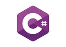**C# (C Sharp)** est un langage de programmation multiparadigme d�velopp� par Microsoft. Il englobe des disciplines telles que la programmation imp�rative, d�clarative, fonctionnelle, g�n�rique, orient�e objet (bas�e sur la classe) et orient�e vers les composants. C# est largement utilis� pour le d�veloppement d'applications logicielles, en particulier dans l'�cosyst�me de d�veloppement sur la plateforme .NET de Microsoft. Il offre aux d�veloppeurs un ensemble riche de fonctionnalit�s et une syntaxe intuitive pour la cr�ation d'applications robustes et �volutives pour une vari�t� de plates-formes, y compris les applications de bureau, les applications web et les applications mobiles

**MySQL** est un syst�me de gestion de base de donn�es relationnelle open source tr�s populaire. Il est utilis� par de nombreuses entreprises et organisations pour stocker et g�rer efficacement de grandes quantit�s de donn�es.

**MySQL** est r�put� pour sa fiabilit�, sa stabilit� et sa performance, ainsi que pour sa facilit� d'utilisation. Il permet aux utilisateurs de cr�er, de modifier et de supprimer des bases de donn�es, des tables et des colonnes de mani�re simple et intuitive.

En outre, **MySQL** prend en charge le langage de requ�te SQL, qui est utilis� pour interroger et extraire des donn�es de la base de donn�es. C'est une solution de base de donn�es flexible qui est utilis�e par des millions d'utilisateurs � travers le monde.

#### **c.**      **Les cadres applicatifs (Frameworks)**

##### **1)**      **WPF**

Le **Windows Presentation Foundation (WPF)** est un framework de d�veloppement logiciel con�u par Microsoft pour cr�er des applications Windows avec des interfaces utilisateur graphiques modernes et interactives. Il utilise un langage de balisage appel� **XAML** (**eXtensible** **Application Markup Language**) pour d�finir l'apparence et le comportement des �l�ments de l'interface utilisateur. WPF offre des fonctionnalit�s telles que la mise en page flexible, les animations, la liaison de donn�es, et facilite la cr�ation d'applications riches en fonctionnalit�s.

##### **2)**    **NET 8.0**

Le **Framework .NET 8.0** est une plateforme de d�veloppement logiciel con�ue par Microsoft pour cr�er des applications sur diff�rentes plateformes telles que Windows, macOS et Linux. Il fournit un ensemble d'outils et de biblioth�ques pour simplifier le processus de d�veloppement et permet aux d�veloppeurs de cr�er des applications robustes et �volutives en utilisant des langages de programmation tels que **C#**, F# et VB.NET.

#### **d.**     **Architecture d�application**

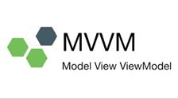L'architecture **MVVM (Mod�le-Vue-VueMod�le)** est un mod�le de conception utilis� pour d�velopper des applications logicielles, en particulier pour les applications de bureau et mobiles.

Dans **MVVM** :

�         Le **Mod�le** g�re les donn�es et la logique m�tier.

�         La **Vue** repr�sente l'interface utilisateur (**UI**) visible par l'utilisateur.

�         Le **VueMod�le** agit comme un interm�diaire entre le Mod�le et la Vue, g�rant la logique de pr�sentation et fournissant les donn�es � afficher.

**MVVM** facilite la s�paration des pr�occupations entre l'interface utilisateur et la logique m�tier, ce qui rend le code plus clair, maintenable et testable. Cela permet �galement une collaboration plus efficace entre les d�veloppeurs d'interfaces utilisateur et les d�veloppeurs de logiciels.

**e.**      **Format de package d'application**

**MSIX** est un format de package d�applications Windows qui offre une exp�rience d�empaquetage moderne pour toutes les applications Windows. Le format de package MSIX conserve les packages d�applications et/ou les fichiers d�installation existants tout en proposant de nouvelles fonctionnalit�s d�empaquetage et de d�ploiement modernes pour les applications Win32, WPF et Windows Forms.

MSIX est un format d�empaquetage pour applications Windows con�u pour �tre s�curis� et fiable.

IV.            Conclusion
-------------------------

Ce premier chapitre a fourni un panorama complet du projet, abordant sa probl�matique, son contexte et les outils techniques utilis�s. Le prochain chapitre se concentrera sur l'analyse et la conception, o� nous examinerons en d�tail les concepts essentiels � la gestion de location de voitures, afin d'am�liorer et d'optimiser nos processus.

  

**Chapitre 2 : Conception et mod�lisation**
===========================================

I.                  Introduction
--------------------------------

Dans ce chapitre, nous aborderons les fondamentaux de la gestion de projet et du d�veloppement logiciel, en mettant un accent particulier sur l'analyse et la conception de syst�mes.

II.              Gestion de projet
----------------------------------

La Gestion de projet est indispensable aux professionnelles, elle joue un r�le de plus en plus d�terminant au quotidien dans toutes les activit�s professionnelles. Chaque ann�e, les entreprises ont de nombreux challenges � relever :

�Lancement de nouveaux services ou produits innovants (d�veloppement d'un nouveau logiciel par exemple).

� Mise � jour de technologies d�j� implant�es pour rester comp�titif.

� Adaptation � des contraintes l�gales nationales, ou internationales.

### 2.1               Cycle de vie

**Cycle de vie (lifecycle)** d�signe la p�riode de naissance d�un logiciel � sa mise hors service d�finitive, en passant par sa construction et son utilisation. La vie d�un logiciel est compos�e de diff�rentes �tapes. La succession de ces �tapes forme le cycle de vie du logiciel. Il faut contr�ler la succession de ces diff�rentes �tapes.

### 2.2  Les model�s du cycle de vie

#### **a.**      **Cycle de vie en cascade**

C�est le mod�le le plus simple, il se caract�rise par un d�roulement de phases successives. Il est adapt� pour des projets de petite taille, et dont le domaine est bien ma�tris�.

****

Figure 11:Cycle de vie en cascade

#### **b.**     **Cycle de vie en v**

Le mod�le du cycle en V est un mod�le imagin� suite au probl�me de r�activit� du mod�le en cascade.

Il permet, en cas d'anomalie, de limiter un retour aux �tapes pr�c�dentes. Les phases de la partie montante doivent renvoyer de l'information sur les phases en vis-�-vis lorsque des d�fauts sont d�tect�s, afin d'am�liorer le logiciel. C�est en phase de sp�cification que l�on se pr�occupe des proc�dures de validation. C�est en phase de conception g�n�rale que l�on se pr�occupe des proc�dures d�int�gration. C�est en phase de conception d�taill�e que l�on pr�pare les tests unitaires.

Il est adapt� pour des projets dont le domaine est bien ma�tris�.

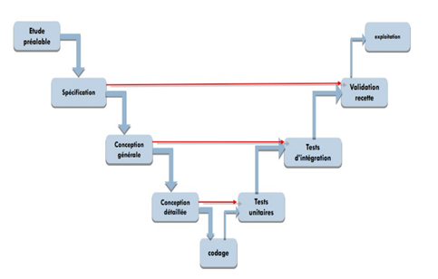

Figure 12: Cycle de vie en v

### 2.3   Diagramme de [_Gantt_](https://www.google.com/search?sca_esv=345267d81bec8f30&sxsrf=ADLYWIIbN5WW3ca2iDYv-cGypVQxzrr71Q:1716119924190&q=diagramme+de+Gantt&spell=1&sa=X&ved=2ahUKEwizoOTz1JmGAxX7T6QEHQCKCM8QkeECKAB6BAgOEAE)

Le **diagramme de Gantt** est une m�thode de repr�sentation graphique qui illustre le calendrier des phases, activit�s, t�ches, et ressources d'un projet. Sur l'axe horizontal, on positionne les jours, semaines ou mois, tandis que l'axe vertical liste les diff�rentes t�ches. Chaque t�che est repr�sent�e par une barre, dont la longueur correspond � sa dur�e estim�e.

Les t�ches peuvent se suivre ou se d�rouler simultan�ment, en totalit� ou partiellement. Cr�� par Henry L. Gantt en 1917, ce diagramme demeure aujourd'hui l'un des outils les plus couramment utilis�s pour la gestion de projet.

III.           Pr�sentation UML
-------------------------------

**UML (Unified Modeling Language)** est un langage graphique standard de mod�lisation utilis� pour repr�senter des syst�mes logiciels. Il offre une m�thode normalis�e pour visualiser la conception d'un syst�me en utilisant diff�rents types de diagrammes.

#### a.     Diagramme de cas d�utilisation

Le **diagramme de cas d'utilisation** est un outil de mod�lisation essentiel qui illustre les interactions entre les utilisateurs et un syst�me. Il organise les fonctionnalit�s du syst�me en cas d'utilisation, qui sont des unit�s logiques d�crivant des actions sp�cifiques que les utilisateurs peuvent r�aliser avec le syst�me. Chaque cas d'utilisation capture un besoin utilisateur, offrant une vue centr�e sur l'utilisateur plut�t qu'une approche technique.

Composants Principaux :

�          **Acteurs** : Les utilisateurs ou autres syst�mes qui interagissent avec le syst�me.

�          **Cas d'utilisation** : Les fonctionnalit�s sp�cifiques du syst�me, pertinentes pour les acteurs.

�          **Relations** : Les connexions entre les cas d'utilisation qui montrent comment ils sont li�s ou d�pendent les uns des autres.

Les diagrammes de cas d'utilisation sont essentiels pour s'assurer que le d�veloppement informatique r�pond pr�cis�ment aux attentes des utilisateurs. Ils jouent un r�le crucial en garantissant la fonctionnalit� et l'efficacit� du syst�me final.

#### b.     Diagramme de classe

**Un diagramme de classe** est un type de diagramme structurel utilis� en g�nie logiciel pour d�crire la structure statique d'un syst�me. Il montre les classes du syst�me, leurs propri�t�s, et les relations entre elles. Cela inclut la visualisation des interactions comme les associations, les h�ritages, et les d�pendances

**Composants Principaux :**

v  **Classes** **:** Repr�sent�es par des rectangles, les classes comprennent trois parties :

�        **Nom de la Classe :** Le titre de la classe, souvent un nom de substantif.

�        **Attributs :** Variables ou propri�t�s stock�es dans la classe.

�        **M�thodes :** Fonctions ou proc�dures que la classe peut ex�cuter.

v  **Relations** **:**

�         **Association :** Une connexion g�n�rale entre deux classes, repr�sent�e par une ligne.

�         **Agr�gation :** Une forme sp�ciale d'association qui repr�sente une relation "tout-partie", marqu�e par un diamant blanc � une extr�mit� de la ligne.

�         **Composition :** Une forme plus forte d'agr�gation avec un diamant noir, indiquant une possession exclusive.

�         **H�ritage :** Repr�sent� par une fl�che pointue, indiquant une relation de type "est-un".

v  **Visibilit�** **:** Indique si les attributs ou m�thodes sont accessibles depuis d'autres classes, souvent not� par des symboles (**+, -, #**).

#### c.      Diagramme de s�quence

**Le diagramme de s�quence** est un outil crucial en g�nie logiciel, relevant des diagrammes comportementaux et plus sp�cifiquement des diagrammes d'interactions. Il est utilis� pour repr�senter les interactions entre les diff�rents objets et acteurs d'un syst�me informatique, montrant comment ils communiquent entre eux au fil du temps.

Composants Principaux :

v  **Lignes** **de Vie :** Repr�sent�es par des lignes verticales qui descendent des ent�tes des objets ou acteurs, elles indiquent la pr�sence de l'objet au fil du temps.

v  **Barres** **d'Activation :** Des rectangles fins sur les lignes de vie qui montrent quand un objet est actif dans le processus.

v  **Messages** **:** Fl�ches horizontales qui montrent les interactions entre les objets, avec des annotations pour d�crire l'action ou la m�thode appel�e.

IV.            Notre projet de location de voiture
--------------------------------------------------

### a.      Planification

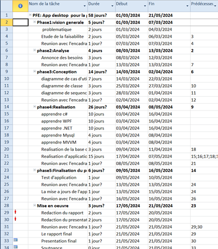

Figure 13 : Planification

### b.     Cycle de vie en V

Nous avons choisi le cycle en V. Car ce mod�le est caract�ris� par le parall�lisme, dans ce mod�le verticalement nous trouvons les �tapes du d�veloppement et horizontalement la v�rification.

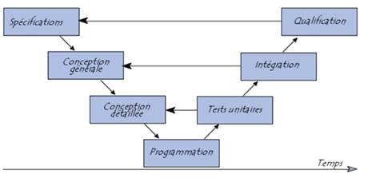

Figure 14: Cycle de vie en v

### c.      Diagramme de Gantt

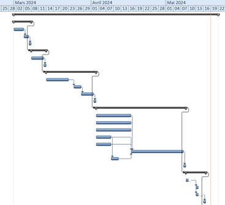

Figure 15 : Diagramme de GANTT partie1

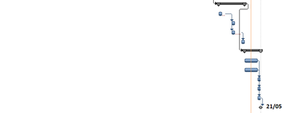

Figure 16: Diagramme de GANTT partie2

### d.     Mod�lisation

#### **1)**      **Les acteurs**

Identification des acteurs et leur r�le :

**Acteurs**

**R�le**

**Administrateur**

�         G�rer les voitures

�         G�rer les employ�es

**Employ�**

�         G�rer les clients

�         G�rer les r�servations

�         G�rer les paiements

**Client**

�         Voir les voitures disponibles

�         Faire une r�servation

**Tableau** **2:** **table des acteurs**

#### **2)**     **Diagramme de cas d�utilisation**

Figure 17 : Diagramme de cas d�utilisation

#### **3)**     **Diagramme de classe**

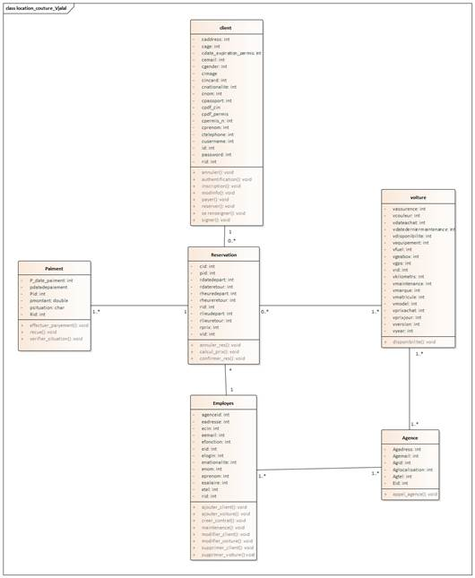

Figure 18 :Diagramme de classe

  

#### **4)**     **Diagramme de** **s�quence**

**Pour login**

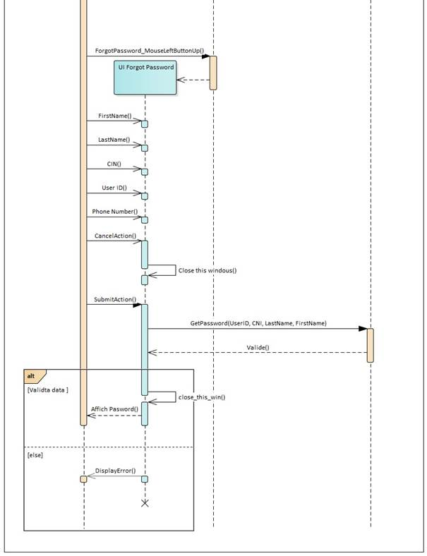

Figure 19 : diagramme de s�quence(login)

**Pour employer**

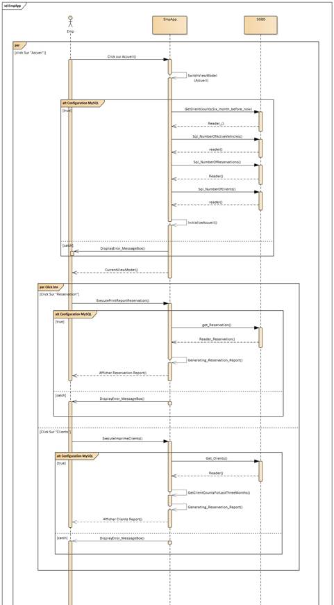

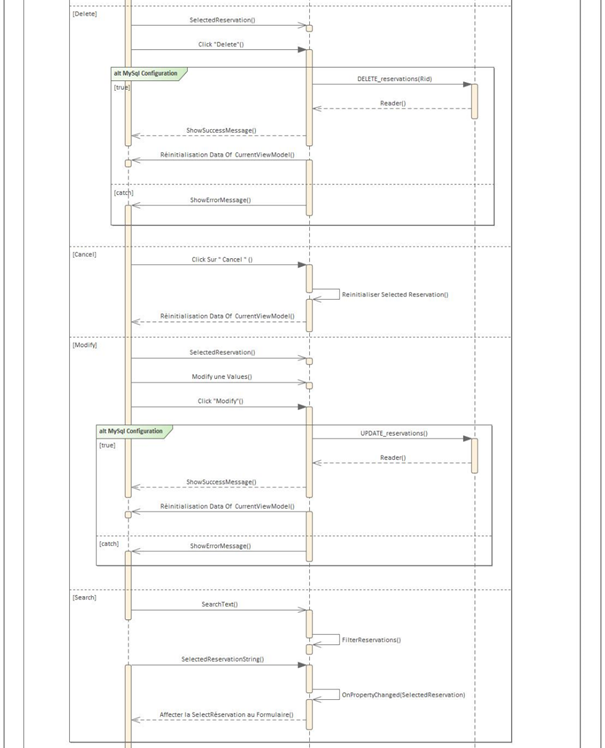

Figure 20: diagramme de s�quence (employer)

**Pour l�administrateur**

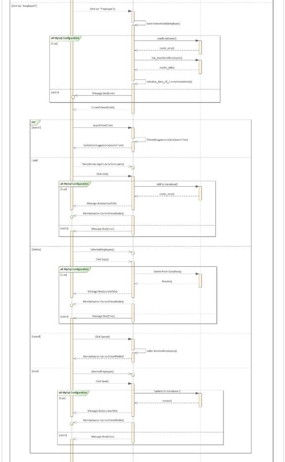

Figure 21 : diagramme de s�quence (administrateur)

Dans ces diagrammes ???????

V.               Conclusion
---------------------------

Dans ce chapitre, nous avons d�velopp� les divers composants de notre syst�me. Le chapitre suivant sera consacr� � la mise en �uvre de notre mod�le.

  

**Chapitre 3 : R�alisation du projet**
======================================

I.                  Introduction
--------------------------------

La phase de r�alisation est une �tape tr�s importante dans le cycle de vie de nos applications, cette phase permet de concr�tiser notre projet par le d�veloppement des interfaces et par des r�alisations concr�tes des fonctionnalit�s du syst�me. Pour r�aliser ces applications nous avons en recourt � plusieurs outils de d�veloppement. Dans cette derni�re partie on va pr�senter le r�sultat final de notre application.

II.              Application Desktop
------------------------------------

### 2.1 Les interfaces et les explications

#### **1)**      **Authentification**

Figure 22 : login

L'interface d'authentification constitue la premi�re �tape d'interaction entre l'utilisateur et notre application de bureau.

#### **2)**     **Interface Forget password**

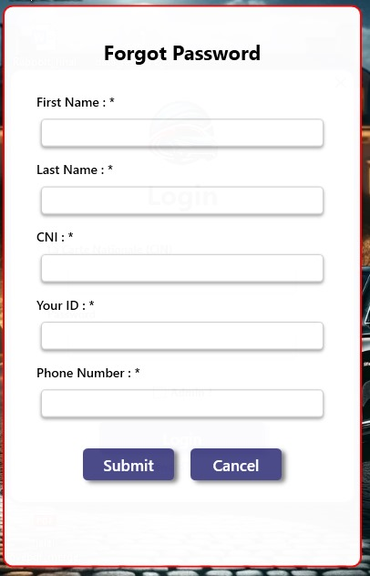

Figure 23 : forget password

L'interface de r�cup�ration de mot de passe est une partie essentielle de notre application de bureau. Elle aide les utilisateurs � r�cup�rer leur acc�s s'ils oublient leurs identifiants.

#### **3)**     **Les interfaces d�administrateur**

##### **a.**      **Interface accueil**

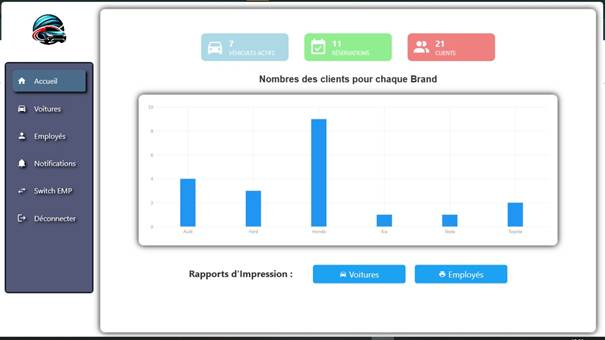

Figure 24 :  interface d�accueil pour l'administrateur

L'interface d'accueil pour l'administrateur fournit un aper�u complet des v�hicules sortis, des r�servations effectu�es et du nombre de clients enregistr�s dans la base de donn�es. Elle pr�sente des graphiques illustrant le nombre de clients par marque, ainsi que divers indicateurs cl�s. De plus, elle offre des options pour imprimes des rapports sur les voitures et les employ�s.

##### **b.**     **Interface voiture**

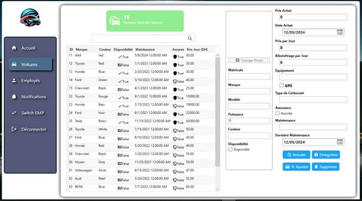

Figure 25 :  interface des voitures pour l'administrateur

L'interface des voitures pour l'administrateur affiche le nombre total de v�hicules enregistr�s dans la base de donn�es. Elle propose �galement des fonctionnalit�s permettant d'ajouter une nouvelle voiture, ainsi que de modifier ou supprimer les entr�es existantes, facilitant ainsi la gestion compl�te des voitures. 

##### **c.**      **Interface employ�e**

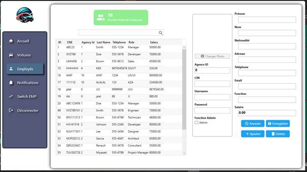

Figure 26 : interface des employ�s pour l'administrateur

L'interface des employ�s pour l'administrateur affiche le nombre total d'employ�s enregistr�s dans la base de donn�es. Elle propose �galement des fonctionnalit�s permettant d'ajouter un nouvel employ�, ainsi que de modifier ou supprimer les entr�es existantes, facilitant ainsi la gestion compl�te du personnel. 

##### **d.**     **Interface notification**

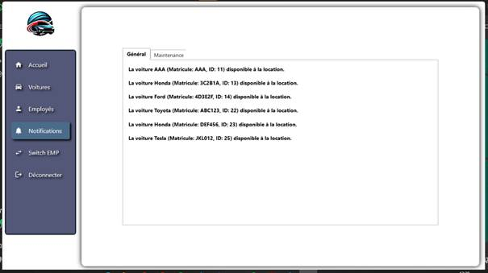

Figure 27 :  interface de notification pour l'administrateur

L'interface de notification indique, sous l'onglet "G�n�ral", les v�hicules disponibles pour la location. Dans l'onglet "Maintenance", elle affiche des alertes pour les v�hicules qui requi�rent une maintenance. Cette fonctionnalit� assure une gestion efficace du parc automobile en offrant des mises � jour en temps r�el sur l'�tat des v�hicules, facilitant ainsi l'organisation de la location et de la maintenance des voitures.

#### **4)**     **Les interfaces d�employ�e**

##### **a.**      **Interface accueil**

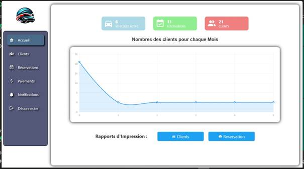

Figure 28 :  interface d'accueil pour l'employ�

L'interface d'accueil pour l'employ� pr�sente un r�sum� d�taill� des r�servations effectu�es et du total de clients enregistr�s dans la base de donn�es. Un graphique y illustre le nombre de clients ayant lou� une ou plusieurs voitures chaque mois, accompagn� d'autres indicateurs cl�s. De plus, cette interface offre la possibilit� d'imprimer des rapports approfondis sur les clients et les r�servations.

##### **b.**     **Interface client**

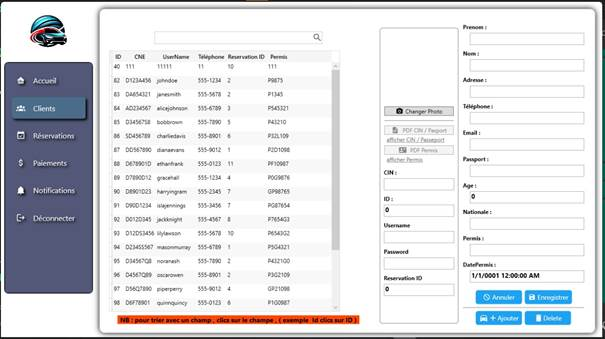

Figure 29 : interface client pour l'employ�

L'interface client affiche le nombre total de clients enregistr�s dans la base de donn�es. Elle offre �galement des options pour ajouter, modifier ou supprimer des clients, facilitant ainsi la gestion efficace de la client�le. Cette interface centralise les informations client, am�liorant l'organisation et la communication au sein de l'entreprise.

##### **c.**      **Interface r�servation**

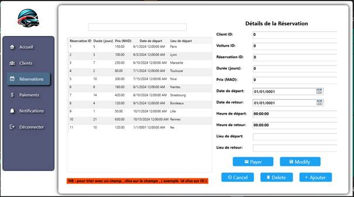

Figure 30 :  interface de r�servation pour l'employ�

L'interface de r�servation permet d'ajouter, de modifier ou de supprimer des r�servations, simplifiant ainsi leur gestion. Elle centralise toutes les informations relatives aux r�servations, ce qui contribue � am�liorer l'organisation et la communication dans l'entreprise.

##### **d.**     **Interface paiements**

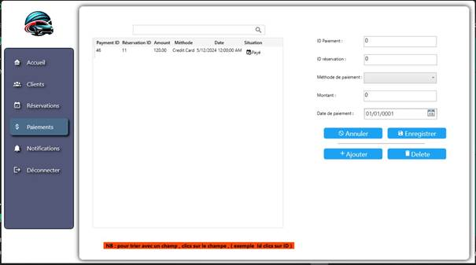

Figure 31 : interface de paiements pour l'employ�

L'interface de paiements permet d'ajouter, d'enregistrer, ou de supprimer des paiements.

##### **e.**      **Interface notification**

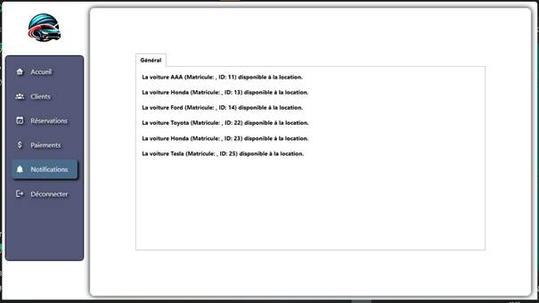

Figure 32 : interface de notification pour l'employ�

L'interface de notification indique, sous l'onglet "G�n�ral", les v�hicules disponibles pour la location.

  

**Conclusion G�n�rale**
=======================

Ce projet constitue une �tape cruciale de notre parcours de formation, offrant une excellente opportunit� pour mettre en pratique des connaissances th�oriques pr�alablement acquises tout en nous permettant de d�velopper de nouvelles comp�tences techniques. Pour mener � bien ce projet, nous avons �labor� un plan d�taill�, facilitant l'organisation de notre temps limit� et optimisant notre efficacit�.

Parall�lement, nous avons d�couvert l'importance cruciale de la recherche et de la communication dans l'acc�s � des informations pertinentes, ainsi que la gestion du temps et la planification des t�ches pour une ex�cution fluide des travaux. Gr�ce � un environnement de travail propice et � une coordination efficace, nous avons r�ussi � achever le projet conform�ment au cahier des charges, tout en y ajoutant des fonctionnalit�s suppl�mentaires pour en augmenter l'efficacit� et l'attrait.

Bien que notre projet r�ponde d�j� � tous les besoins �nonc�s dans le cahier des charges, nous envisageons d'apporter des am�liorations futures pour am�liorer la performance de l'application.

Les r�sultats obtenus jusqu'� pr�sent sont prometteurs et nous motivent � poursuivre le d�veloppement de ce projet.

  

**Webographie**
===============

**MySQL****:** [https://www.w3schools.com/](https://www.w3schools.com/)

**MSIX :** [https://youtu.be/4t2TI8ImwMY](https://youtu.be/4t2TI8ImwMY)

**C# WPF :** [https://www.youtube.com/watch?v=t9ivUosw\_iI&list=PLih2KERbY1HHOOJ2C6FOrVXIwg4AZ-hk1](https://www.youtube.com/watch?v=t9ivUosw_iI&list=PLih2KERbY1HHOOJ2C6FOrVXIwg4AZ-hk1)

**WPF MVVM :**

[https://www.youtube.com/watch?v=fZxZswmC\_BY&list=PLA8ZIAm2I03hS41Fy4vFpRw8AdYNBXmNm](https://www.youtube.com/watch?v=fZxZswmC_BY&list=PLA8ZIAm2I03hS41Fy4vFpRw8AdYNBXmNm)
