               	

**Filière Sciences Mathématiques et Informatique**

**Projet de Fin d’Etudes**

<b>Semestre S6</b>

**Mémoire**

**Gestion de location de voiture**

Présenté par :

**Bouhrir Ayat						      	Zerroudi Jalal**

Encadrant : **Pr. Bennani Mohamed Taj**

Soutenu le : 

Jury : 

Examinateur 1 :

Examinateur 2 :	

***Année Universitaire : 2023/2024***

# **Remerciements**

**Au nom d’Allah le tout miséricordieux,**

On tient à adresser mes sincères remerciements à mon encadrant, Monsieur **Bennani Mohamed Taj**, pour son accompagnement précieux tout au long de mon projet de fin d'études. Son expertise, ses conseils judicieux et son soutien constant ont été essentiels à la réussite de ce travail. Je suis profondément reconnaissant pour sa patience et son engagement envers mon développement académique et professionnel.

Nous tenons également à remercier **les membres du jury** pour leur évaluation attentive de notre travail.

Un merci spécial à tous ceux qui ont contribué, directement ou indirectement, à la réalisation de ce projet.

# **Résumé**

Ce projet de fin d'études présente le développement d'une application de bureau innovante, destinée à révolutionner la gestion des opérations au sein d'une agence de location de voitures. L'objectif principal est de simplifier et d'automatiser l'organisation des données, améliorant ainsi l'efficacité et la productivité de l'agence.

L'application offre une solution complète pour la gestion des réservations, des clients, des véhicules et des employés. Elle permet aux employées de gérer facilement les flux de travail quotidiens, l'application permet de réduire les erreurs humaines et de maximiser l'utilisation des ressources.

La phase de conception du projet a débuté par une analyse des besoins dans ce secteur, suivie par l'élaboration d'une étude conceptuelle et technique. Cette étape préliminaire a été cruciale pour définir les spécifications et l'architecture logicielle nécessaires. 

Le **backend** de l’application est base sur deux éléments essentiels : le langage de programmation **C#** et **MySQL** pour la gestion de la base de données.

Le **frontend** utilise **Windows Presentation Foundation (WPF)** avec le framework **.NET 8.0** pour offrir une expérience utilisateur riche et interactive.

# **Sommaire**
#

[Remerciements	2****](#_toc167027324)**

[**Résumé	3****](#_toc167027325)

[**Sommaire	4****](#_toc167027326)

[**Liste des figures	6****](#_toc167027327)

[**Liste des Tables	6****](#_toc167027328)

[**Liste des Acronymes	7****](#_toc167027329)

[**Introduction Générale	8****](#_toc167027330)

[**Chapitre 1 : Analyse et cadre générale de projet	9****](#_toc167027331)

[I.	INTRODUCTION	9](#_toc167027332)

[II.	Étude de cahier de charge	9](#_toc167027333)

[2.1	 Problématique	9](#_toc167027334)

[2.2	 L’objectif	9](#_toc167027335)

[2.3	Solution	9](#_toc167027336)

[III	. Analyse des besoins	10](#_toc167027337)

[3.1	 Les besoins fonctionnels	10](#_toc167027338)

[3.2	 Les besoins techniques	11](#_toc167027339)

[**a.**	**Outils et technologies	11****](#_toc167027340)

[**b.**	**Les langages de programmation utilisés	13****](#_toc167027341)

[**c.**	**Les cadres applicatifs (Frameworks)	14****](#_toc167027342)

[**1)**	**WPF**	14](#_toc167027343)

[**2)**	**NET 8.0**	14](#_toc167027344)

[**d.**	**Architecture d’application	15****](#_toc167027345)

[IV.	Conclusion	16](#_toc167027346)

[**Chapitre 2 : Conception et modélisation	17****](#_toc167027347)

[I.	Introduction	17](#_toc167027348)

[II.	Gestion de projet	17](#_toc167027349)

[2.1	Cycle de vie	17](#_toc167027350)

[2.2	Les modelés du cycle de vie	17](#_toc167027351)

[**a.**	**Cycle de vie en cascade	17****](#_toc167027352)

[**b.**	**Cycle de vie en v	18****](#_toc167027353)

[2.3	Diagramme de *Gantt*	19](#_toc167027354)

[III.	Présentation UML	19](#_toc167027355)

[**a.**	**Diagramme de cas d’utilisation	20****](#_toc167027356)

[**b.**	**Diagramme de classe	20****](#_toc167027357)

[**c.**	**Diagramme de séquence	21****](#_toc167027358)

[IV.	Notre projet de location de voiture	22](#_toc167027359)

[a.	Planification	22](#_toc167027360)

[b.	Cycle de vie en V	23](#_toc167027361)

[c.	Diagramme de Gantt	23](#_toc167027362)

[d.	Modélisation	24](#_toc167027363)

[**1)**	**Les acteurs	24****](#_toc167027364)

[**2)**	**Diagramme de cas d’utilisation	25****](#_toc167027365)

[**3)**	**Diagramme de classe	26****](#_toc167027366)

[**4)**	**Diagramme de séquence	27****](#_toc167027367)

[V.	Conclusion	39](#_toc167027368)

[**Chapitre 3 : Réalisation du projet	40****](#_toc167027369)

[I.	Introduction	40](#_toc167027370)

[II.	Application Desktop	40](#_toc167027371)

[2.1	Les interfaces et les explications	40](#_toc167027372)

[**1)**	**Authentification	40****](#_toc167027373)

[**2)**	**Interface Forget password	41****](#_toc167027374)

[**3)**	**Les interfaces d’administrateur	42****](#_toc167027375)

[**a.**	**Interface accueil**	42](#_toc167027376)

[**b.**	**Interface voiture**	43](#_toc167027377)

[**c.**	**Interface employée**	44](#_toc167027378)

[**d.**	**Interface notification**	45](#_toc167027379)

[**4)**	**Les interfaces d’employée	46****](#_toc167027380)

[**a.**	**Interface accueil**	46](#_toc167027381)

[**b.**	**Interface client**	47](#_toc167027382)

[**c.**	**Interface réservation**	48](#_toc167027383)

[**d.**	**Interface paiements**	49](#_toc167027384)

[**e.**	**Interface notification**	50](#_toc167027385)

[**Conclusion Générale	51****](#_toc167027386)

[**Webographie	52****](#_toc167027387)

# **Liste des figures**
[Figure 1: Visual Studio logo	11](#_toc167031605)

[Figure 2: Laragon logo	11](#_toc167031606)

[Figure 3:Entreprise Architect logo	12](#_toc167031607)

[Figure 4: MS Project logo	12](#_toc167031608)

[Figure 5:C# logo	13](#_toc167031609)

[Figure 6: MySQL	13](#_toc167031610)

[Figure 7: WPF logo	14](#_toc167031611)

[Figure 8 : .NET 8.0 logo	14](#_toc167031612)

[Figure 9 : MVVM logo	15](#_toc167031613)

[Figure 10: MSIX logo	15](#_toc167031614)

[Figure 11:Cycle de vie en cascade	18](#_toc167031615)

[Figure 12: Cycle de vie en v	19](#_toc167031616)

[Figure 13 : Planification	22](#_toc167031617)

[Figure 14: Cycle de vie en v	23](#_toc167031618)

[Figure 15 : Diagramme de GANTT partie1	23](#_toc167031619)

[Figure 16: Diagramme de GANTT partie2	24](#_toc167031620)

[Figure 17 : Diagramme de cas d’utilisation	25](#_toc167031621)

[Figure 18 :Diagramme de classe	26](#_toc167031622)

[Figure 19 : diagramme de  séquence(login)	28](#_toc167031623)

[Figure 20: diagramme de séquence (employer)	34](#_toc167031624)

[Figure 21 : diagramme de séquence (administrateur)	38](#_toc167031625)

[Figure 22 : login	40](#_toc167031626)

[Figure 23 : forget password	41](#_toc167031627)

[Figure 24 :  interface d’accueil pour l'administrateur	42](#_toc167031628)

[Figure 25 :  interface des voitures pour l'administrateur	43](#_toc167031629)

[Figure 26 : interface des employés pour l'administrateur	44](#_toc167031630)

[Figure 27 :  interface de notification pour l'administrateur	45](#_toc167031631)

[Figure 28 :  interface d'accueil pour l'employé	46](#_toc167031632)

[Figure 29 : interface client pour l'employé	47](#_toc167031633)

[Figure 30 :  interface de réservation pour l'employé	48](#_toc167031634)

[Figure 31 : interface de paiements pour l'employé	49](#_toc167031635)

[Figure 32 : interface de notification pour l'employé	50](#_toc167031636)

# **Liste des Tables**

[Tableau 1:la liste des acronymes dans le projet	7](#_toc167027441)

[**Tableau 2: table des acteurs**	24](#_toc167027442)
#

# **Liste des Acronymes**

|
> **Abréviation**

>
|> **Désignation**|
| :-: | :-: |
|> **UML**|
> **Unified Modeling Language**

|
|> **C#**|
> **C Sharp**

|
|> **MySQL**|
> **My Structured Query Language**

|
|> **MVVM**|
> **Model-View-ViewModel**

|
|> **.NET 8.0**|
> **Network Enabled Technologies (version 8.0)**

|
|> **WPF**|
> **Windows Presentation Foundation**

|
|> **MSIX**|
> **Microsoft Installer for XML**

|

*Tableau 1:la liste des acronymes dans le projet*

# **Introduction Générale**

La location de voitures est devenue un secteur en pleine expansion, dont la compétitivité augmente jour après jour. Ce service permet aux clients, professionnels ou particuliers, de réserver et prendre un véhicule pour une période donnée, allant de quelques jours à plusieurs mois.

À l'approche de la COP du Monde en 2030, le Maroc voit affluer de plus en plus de touristes, ce qui augmente la demande pour les agences de voyages et de location de voitures. Pour répondre efficacement aux besoins des visiteurs étrangers, une bonne organisation au niveau des agences de location de voitures est cruciale.

C’est pourquoi nous nous engageons à réaliser une application de bureau pour gérer les voitures, les employés, les clients et l'administration.

Le présent rapport synthétise tout le travail que nous avons effectué. Il est composé de plusieurs chapitres :

**Le premier chapitre** établit le cadre général du projet en présentant la problématique, les objectifs, la solution envisagée, l'analyse des besoins ainsi que les algorithmes associés.

**Le deuxième chapitre** détaille l'analyse fonctionnelle et technique du projet, la conception et les différents diagrammes UML utilisés.

**Le troisième chapitre** expose les différentes interfaces de l’application.

Nous terminons par une conclusion générale.

# **Chapitre 1 : Analyse et cadre générale de projet**

1. ## **INTRODUCTION**
   ##
Ce chapitre présente le projet de développement d'une application de bureau pour la gestion d'une agence de location de voitures. Nous aborderons les spécifications fonctionnelles et techniques, les défis actuels rencontrés par les agences de location, la solution proposée et un aperçu du planning du projet.

1. ## **Étude de cahier de charge**
   ### **2.1		Problématique**
##
La plupart des agences de location de voiture utilisent la méthode traditionnelle, qui est basée sur des journaux, ni organisation ni hiérarchie... les documents et les fichiers étant éparpillés, rendant ainsi les tâches plus difficiles et engendrer par la suite une grande perte de temps et d’argent.

### **2.2		L’objectif**

L'objectif principal de ce projet est de fournir un système complet qui contient une application de bureau permettant d’effectuer les tâches suivantes : gérer les voitures, les employés, les clients et l'administration.

3. ### **Solution**

Après une étude approfondie, qui a abouti à la conception d'une application de bureau offrant les fonctionnalités standards d'une société de location de voitures, celle-ci promet de simplifier le travail au sein de l'agence. L'application comportera deux espaces distincts : un espace réservé aux employés, leur permettant de gérer les clients, les réservations et les paiements, et un autre espace destiné à l'administrateur, lui donnant accès à la gestion du personnel, des véhicules et de toutes les tâches pouvant être effectuées par ce dernier.

## **III	.	Analyse des besoins**
##
Dans la phase d’analyse, on cherche d’abord à bien comprendre et à décrire de façon précise les besoins des utilisateurs de l’application. Que souhaitent-ils faire avec cette application ? Quelles fonctionnalités veulent-ils ? Pour quel usage ? Comment l’action devrait-elle fonctionner ? C’est ce qu’on appelle « l’analyse des besoins ». Il y a deux types de besoins.
##
### **3.1		Les besoins fonctionnels** 
##
La solution proposée consiste á réaliser une applications desktop qui offerts :

- **Gestion des clients :**
- Voir les voitures disponibles.
- Réserver, signer un contrat et payer. 

- **Gestion des voitures :**
- Enregistrement des informations sur les véhicules (numéro de matricule, couleur, équipements, type…) est une tâche effectuée par l'administrateur. 

- **Gestion des employés :**
- Renseigner le client 
- Voir la disponibilité, établir, vérifier les réservations. 
- Confirmer une réservation.
- Valider le paiement. 
- **Gestion d'administration :**
- Enregistrement des informations des employés et des voitures. (Ajouter, modifier, supprimer). 
- Maintenance des voitures.

### **3.2		Les besoins techniques**
##
1. #### **Outils et technologies**

   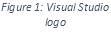**Visual Studio** est un environnement de développement intégré (IDE) avancé de Microsoft, conçu pour les développeurs de logiciels travaillant principalement sur les plateformes Windows et .NET .Il prend en charge divers langages de programmation, notamment C#, VB.NET, et C++. Visual Studio est reconnu pour ses outils robustes de débogage, de test, et de gestion de versions, qui facilitent le développement d'applications de bureau, web et mobiles. Avec une interface utilisateur intuitive et des options de personnalisation via des extensions, Visual Studio aide les développeurs à optimiser leur flux de travail et à améliorer la qualité de leurs projets.
**

**Laragon** est une plateforme de développement web locale qui simplifie la configuration et la gestion des environnements de développement pour les développeurs. Il intègre un serveur web (Apache ou Nginx), un système de gestion de base de données (**MySQL** ou MariaDB), et un ensemble d'outils pour le développement web (**C#**, Node.js, Python, etc.) dans une interface conviviale.

**Laragon** permet aux développeurs de démarrer rapidement leurs projets web sur leur machine locale, en offrant une installation simple, des fonctionnalités de gestion avancées et une compatibilité avec un large éventail de technologies web.

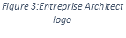**Enterprise Architect** est un outil de modélisation UML largement utilisé pour la conception et la modélisation de systèmes d'information et de logiciels. Cet outil offre une large gamme de fonctionnalités pour les architectes d'entreprise, y compris la création de diagrammes UML, la modélisation de processus métier, la gestion des exigences et des tests. 

**Microsoft Office Project**, aussi appelé **Microsoft Project**, est un logiciel de gestion de projet extrêmement complet et très prisé dans les entreprises et organisations de divers secteurs. Ce programme permet aux utilisateurs de planifier, de suivre et de gérer des projets de différentes envergures et complexités de manière efficace. Microsoft Project offre plusieurs avantages, tels que :

La capacité de planifier les différentes étapes d’un projet, de fixer des échéances et des calendriers, et de suivre leur progression en temps réel.

La possibilité d’affecter les ressources nécessaires à chaque phase du projet et de surveiller les coûts associés à chaque activité.

L'option de visualiser les projets via des diagrammes de Gantt et des diagrammes de réseau pour une meilleure compréhension de l'avancement du projet.

La personnalisation des tableaux de bord pour qu'ils répondent aux exigences spécifiques de chaque projet
##
1. #### **Les langages de programmation utilisés**

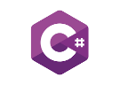

**C# (C Sharp)** est un langage de programmation multiparadigme développé par Microsoft. Il englobe des disciplines telles que la programmation impérative, déclarative, fonctionnelle, générique, orientée objet (basée sur la classe) et orientée vers les composants. C# est largement utilisé pour le développement d'applications logicielles, en particulier dans l'écosystème de développement sur la plateforme .NET de Microsoft. Il offre aux développeurs un ensemble riche de fonctionnalités et une syntaxe intuitive pour la création d'applications robustes et évolutives pour une variété de plates-formes, y compris les applications de bureau, les applications web et les applications mobiles
##
##

**MySQL** est un système de gestion de base de données relationnelle open source très populaire. Il est utilisé par de nombreuses entreprises et organisations pour stocker et gérer efficacement de grandes quantités de données. 

**MySQL** est réputé pour sa fiabilité, sa stabilité et sa performance, ainsi que pour sa facilité d'utilisation. Il permet aux utilisateurs de créer, de modifier et de supprimer des bases de données, des tables et des colonnes de manière simple et intuitive.

En outre, **MySQL** prend en charge le langage de requête SQL, qui est utilisé pour interroger et extraire des données de la base de données. C'est une solution de base de données flexible qui est utilisée par des millions d'utilisateurs à travers le monde.
##
1. #### **Les cadres applicatifs (Frameworks)**
#####
1) ##### **WPF**

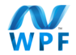

Le **Windows Presentation Foundation (WPF)** est un framework de développement logiciel conçu par Microsoft pour créer des applications Windows avec des interfaces utilisateur graphiques modernes et interactives. Il utilise un langage de balisage appelé **XAML** (**eXtensible Application Markup Language**) pour définir l'apparence et le comportement des éléments de l'interface utilisateur. WPF offre des fonctionnalités telles que la mise en page flexible, les animations, la liaison de données, et facilite la création d'applications riches en fonctionnalités.

1) ##### **NET 8.0** 

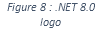Le **Framework .NET 8.0** est une plateforme de développement logiciel conçue par Microsoft pour créer des applications sur différentes plateformes telles que Windows, macOS et Linux. Il fournit un ensemble d'outils et de bibliothèques pour simplifier le processus de développement et permet aux développeurs de créer des applications robustes et évolutives en utilisant des langages de programmation tels que **C#**, F# et VB.NET.

1. #### **Architecture d’application**
##

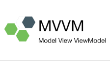L'architecture **MVVM (Modèle-Vue-VueModèle)** est un modèle de conception utilisé pour développer des applications logicielles, en particulier pour les applications de bureau et mobiles. 

Dans **MVVM** :

- Le **Modèle** gère les données et la logique métier.
- La **Vue** représente l'interface utilisateur (**UI**) visible par l'utilisateur.
- Le **VueModèle** agit comme un intermédiaire entre le Modèle et la Vue, gérant la logique de présentation et fournissant les données à afficher.

**MVVM** facilite la séparation des préoccupations entre l'interface utilisateur et la logique métier, ce qui rend le code plus clair, maintenable et testable. Cela permet également une collaboration plus efficace entre les développeurs d'interfaces utilisateur et les développeurs de logiciels.

1. **Format de package d'application**

   **MSIX** est un format de package d’applications Windows qui offre une expérience d’empaquetage moderne pour toutes les applications Windows. Le format de package MSIX conserve les packages d’applications et/ou les fichiers d’installation existants tout en proposant de nouvelles fonctionnalités d’empaquetage et de déploiement modernes pour les applications Win32, WPF et Windows Forms.

   MSIX est un format d’empaquetage pour applications Windows conçu pour être sécurisé et fiable.
4. ## **Conclusion**
   ##
Ce premier chapitre a fourni un panorama complet du projet, abordant sa problématique, son contexte et les outils techniques utilisés. Le prochain chapitre se concentrera sur l'analyse et la conception, où nous examinerons en détail les concepts essentiels à la gestion de location de voitures, afin d'améliorer et d'optimiser nos processus.
##
##

# **Chapitre 2 : Conception et modélisation**

1. ## **Introduction**
   ##
   Dans ce chapitre, nous aborderons les fondamentaux de la gestion de projet et du développement logiciel, en mettant un accent particulier sur l'analyse et la conception de systèmes.

1. ## **Gestion de projet**
   ##
   La Gestion de projet est indispensable aux professionnelles, elle joue un rôle de plus en plus déterminant au quotidien dans toutes les activités professionnelles. Chaque année, les entreprises ont de nombreux challenges à relever : 

   •Lancement de nouveaux services ou produits innovants (développement d'un nouveau logiciel par exemple). 

   • Mise à jour de technologies déjà implantées pour rester compétitif. 

   • Adaptation à des contraintes légales nationales, ou internationales.

   1. ### **Cycle de vie**
      ###
**Cycle de vie (lifecycle)** désigne la période de naissance d’un logiciel à sa mise hors service définitive, en passant par sa construction et son utilisation. La vie d’un logiciel est composée de différentes étapes. La succession de ces étapes forme le cycle de vie du logiciel. Il faut contrôler la succession de ces différentes étapes.
###
2. ### `  `**Les modelés du cycle de vie**

1. #### **Cycle de vie en cascade**

C’est le modèle le plus simple, il se caractérise par un déroulement de phases successives. Il est adapté pour des projets de petite taille, et dont le domaine est bien maîtrisé.

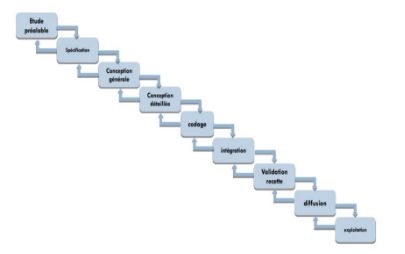

*Figure 11:Cycle de vie en cascade*

1. #### **Cycle de vie en v**

Le modèle du cycle en V est un modèle imaginé suite au problème de réactivité du modèle en cascade. 

Il permet, en cas d'anomalie, de limiter un retour aux étapes précédentes. Les phases de la partie montante doivent renvoyer de l'information sur les phases en vis-à-vis lorsque des défauts sont détectés, afin d'améliorer le logiciel. C’est en phase de spécification que l’on se préoccupe des procédures de validation. C’est en phase de conception générale que l’on se préoccupe des procédures d’intégration. C’est en phase de conception détaillée que l’on prépare les tests unitaires. 

Il est adapté pour des projets dont le domaine est bien maîtrisé.

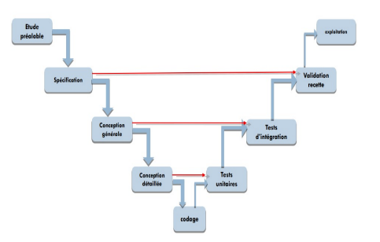

*Figure 12: Cycle de vie en v*

2. ### **Diagramme de [*Gantt***](https://www.google.com/search?sca_esv=345267d81bec8f30&sxsrf=ADLYWIIbN5WW3ca2iDYv-cGypVQxzrr71Q:1716119924190&q=diagramme+de+Gantt&spell=1&sa=X&ved=2ahUKEwizoOTz1JmGAxX7T6QEHQCKCM8QkeECKAB6BAgOEAE)**

   Le **diagramme de Gantt** est une méthode de représentation graphique qui illustre le calendrier des phases, activités, tâches, et ressources d'un projet. Sur l'axe horizontal, on positionne les jours, semaines ou mois, tandis que l'axe vertical liste les différentes tâches. Chaque tâche est représentée par une barre, dont la longueur correspond à sa durée estimée. 

   Les tâches peuvent se suivre ou se dérouler simultanément, en totalité ou partiellement. Créé par Henry L. Gantt en 1917, ce diagramme demeure aujourd'hui l'un des outils les plus couramment utilisés pour la gestion de projet.

1. ## **Présentation UML**
   ##
   **UML (Unified Modeling Language)** est un langage graphique standard de modélisation utilisé pour représenter des systèmes logiciels. Il offre une méthode normalisée pour visualiser la conception d'un système en utilisant différents types de diagrammes.

   1. #### ***Diagramme de cas d’utilisation***

Le **diagramme de cas d'utilisation** est un outil de modélisation essentiel qui illustre les interactions entre les utilisateurs et un système. Il organise les fonctionnalités du système en cas d'utilisation, qui sont des unités logiques décrivant des actions spécifiques que les utilisateurs peuvent réaliser avec le système. Chaque cas d'utilisation capture un besoin utilisateur, offrant une vue centrée sur l'utilisateur plutôt qu'une approche technique. 

Composants Principaux :

- **Acteurs** : Les utilisateurs ou autres systèmes qui interagissent avec le système.
- **Cas d'utilisation** : Les fonctionnalités spécifiques du système, pertinentes pour les acteurs. 
- **Relations** : Les connexions entre les cas d'utilisation qui montrent comment ils sont liés ou dépendent les uns des autres.

Les diagrammes de cas d'utilisation sont essentiels pour s'assurer que le développement informatique répond précisément aux attentes des utilisateurs. Ils jouent un rôle crucial en garantissant la fonctionnalité et l'efficacité du système final.

1. #### **Diagramme de classe**

**Un diagramme de classe** est un type de diagramme structurel utilisé en génie logiciel pour décrire la structure statique d'un système. Il montre les classes du système, leurs propriétés, et les relations entre elles. Cela inclut la visualisation des interactions comme les associations, les héritages, et les dépendances

**Composants Principaux :**

- **Classes :** Représentées par des rectangles, les classes comprennent trois parties :

- **Nom de la Classe :** Le titre de la classe, souvent un nom de substantif.
- **Attributs :** Variables ou propriétés stockées dans la classe.
- **Méthodes :** Fonctions ou procédures que la classe peut exécuter.

- **Relations :**

- **Association :** Une connexion générale entre deux classes, représentée par une ligne.
- **Agrégation :** Une forme spéciale d'association qui représente une relation "tout-partie", marquée par un diamant blanc à une extrémité de la ligne.
- **Composition :** Une forme plus forte d'agrégation avec un diamant noir, indiquant une possession exclusive.
- **Héritage :** Représenté par une flèche pointue, indiquant une relation de type "est-un".

- **Visibilité :** Indique si les attributs ou méthodes sont accessibles depuis d'autres classes, souvent noté par des symboles (**+, -, #**).

1. #### **Diagramme de séquence**

**Le diagramme de séquence** est un outil crucial en génie logiciel, relevant des diagrammes comportementaux et plus spécifiquement des diagrammes d'interactions. Il est utilisé pour représenter les interactions entre les différents objets et acteurs d'un système informatique, montrant comment ils communiquent entre eux au fil du temps.

Composants Principaux :

- **Lignes de Vie :** Représentées par des lignes verticales qui descendent des entêtes des objets ou acteurs, elles indiquent la présence de l'objet au fil du temps.
- **Barres d'Activation :** Des rectangles fins sur les lignes de vie qui montrent quand un objet est actif dans le processus.
- **Messages :** Flèches horizontales qui montrent les interactions entre les objets, avec des annotations pour décrire l'action ou la méthode appelée.

1. ## **Notre projet de location de voiture** 
   ##
   1. ### **Planification**

      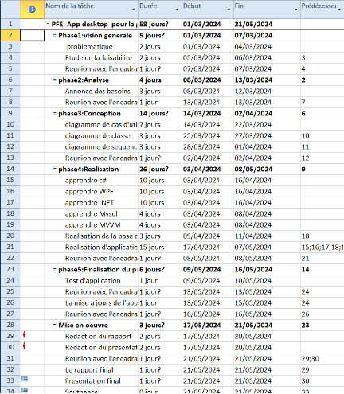

*Figure 13 : Planification*

1. ### **Cycle de vie en V** 

Nous avons choisi le cycle en V. Car ce modèle est caractérisé par le parallélisme, dans ce modèle verticalement nous trouvons les étapes du développement et horizontalement la vérification.

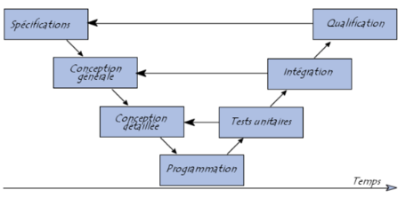

*Figure 14: Cycle de vie en v*
1. ### **Diagramme de Gantt**
   ###
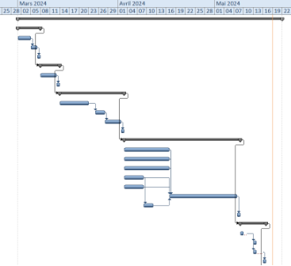

*Figure 15 : Diagramme de GANTT partie1*

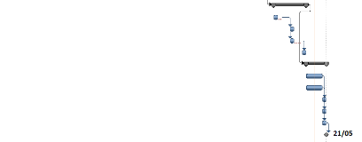

*Figure 16: Diagramme de GANTT partie2*
1. ### **Modélisation**
   ###
1) #### **Les acteurs**

Identification des acteurs et leur rôle :

|**Acteurs**|**Rôle**|
| :-: | :-: |
|

**Administrateur**
|

- Gérer les voitures

- Gérer les employées

|
|

**Employé**
|

- Gérer les clients

- Gérer les réservations

- Gérer les paiements

&emsp;
|
|

**Client**

|

- Voir les voitures disponibles

- Faire une réservation

&emsp;
|
***Tableau 2: table des acteurs***

1) #### **Diagramme de cas d’utilisation**

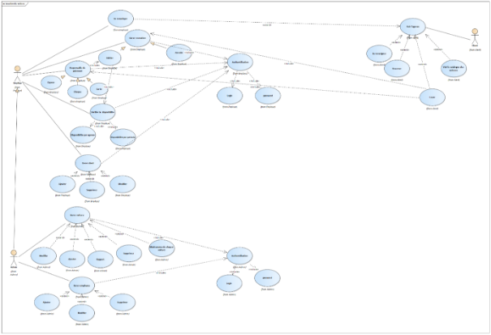

*Figure 17 : Diagramme de cas d’utilisation*

####

1) #### ***Diagramme de classe***

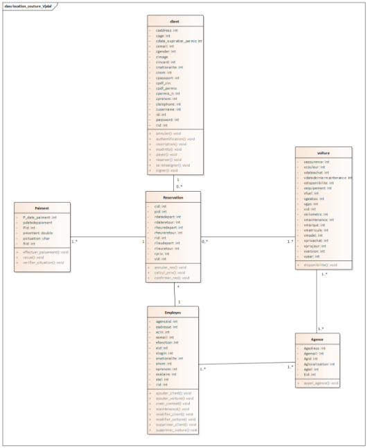

*Figure 18 :Diagramme de classe*

1) #### **Diagramme de séquence**

**Pour login**

`		`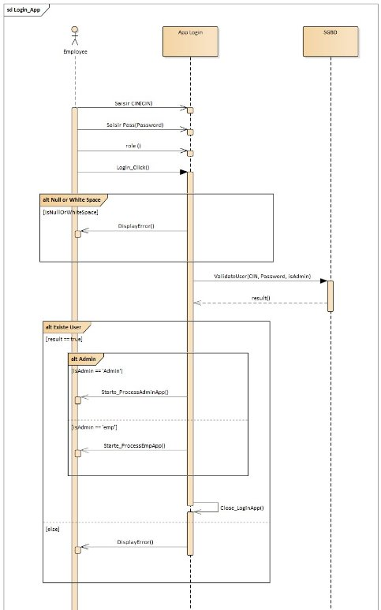

`		         `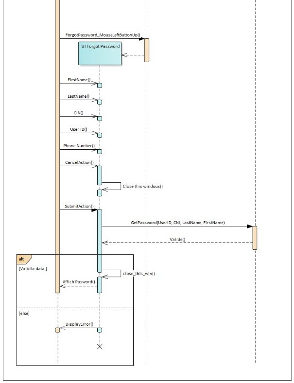

*Figure 19 : diagramme de  séquence(login)*

**Pour employer**

`		`**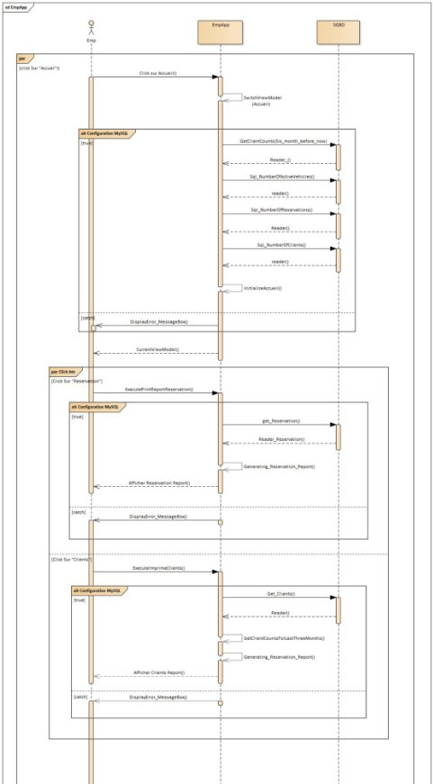**

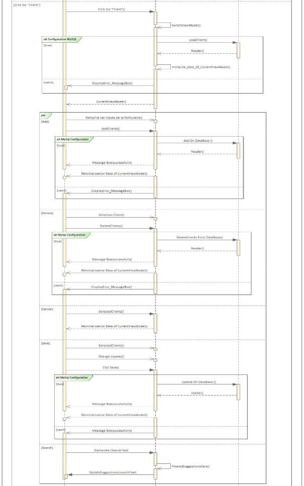

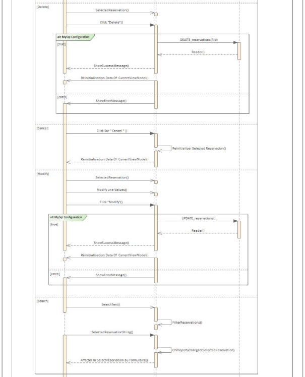

*Figure 20: diagramme de séquence (employer)*

**Pour l’administrateur**

`			`**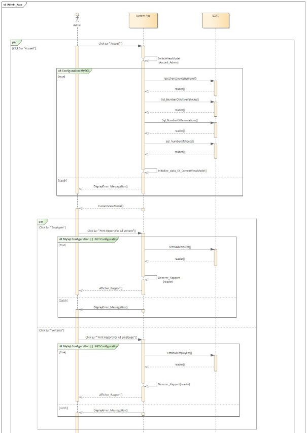**

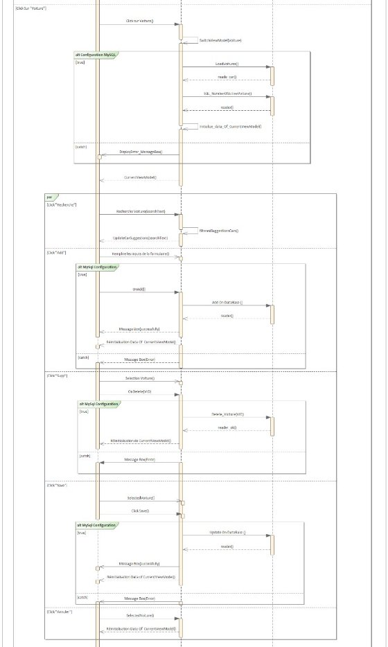

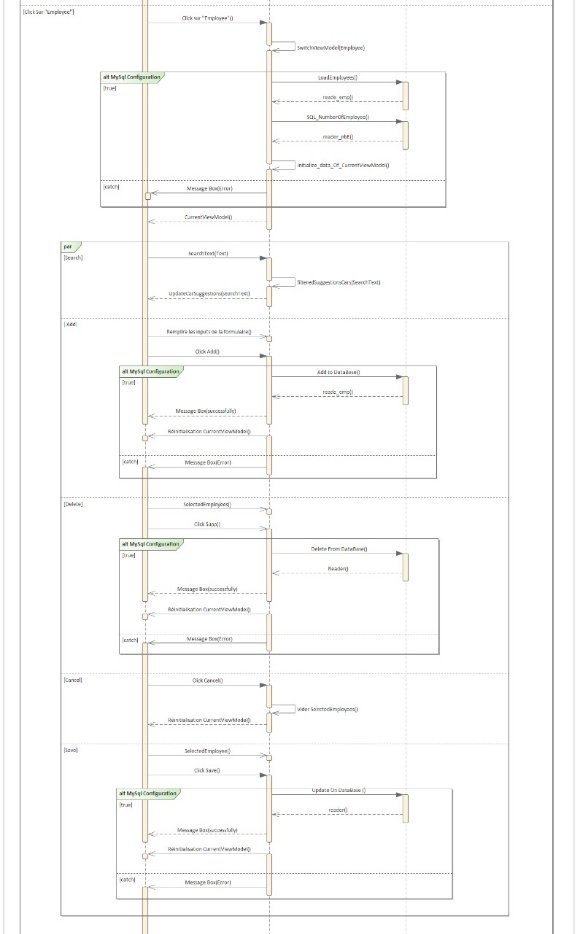

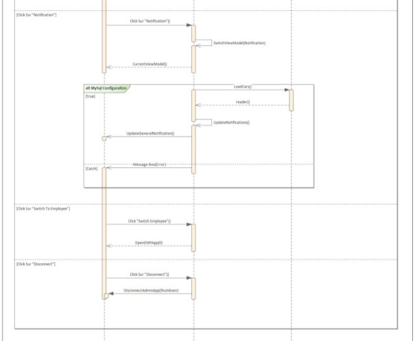

*Figure 21 : diagramme de séquence (administrateur)*

Dans ces diagrammes ???????

1. ## **Conclusion**
   ##
   Dans ce chapitre, nous avons développé les divers composants de notre système. Le chapitre suivant sera consacré à la mise en œuvre de notre modèle.

**			

# **Chapitre 3 : Réalisation du projet**

1. ## **Introduction** 
   ##
   La phase de réalisation est une étape très importante dans le cycle de vie de nos applications, cette phase permet de concrétiser notre projet par le développement des interfaces et par des réalisations concrètes des fonctionnalités du système. Pour réaliser ces applications nous avons en recourt à plusieurs outils de développement. Dans cette dernière partie on va présenter le résultat final de notre application.
   ##
1. ## **Application Desktop**
   ##
   ### **2.1	Les interfaces et les explications**

1) #### **Authentification**

   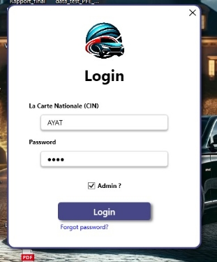

*Figure 22 : login*

L'interface d'authentification constitue la première étape d'interaction entre l'utilisateur et notre application de bureau.
1) #### **Interface Forget password**

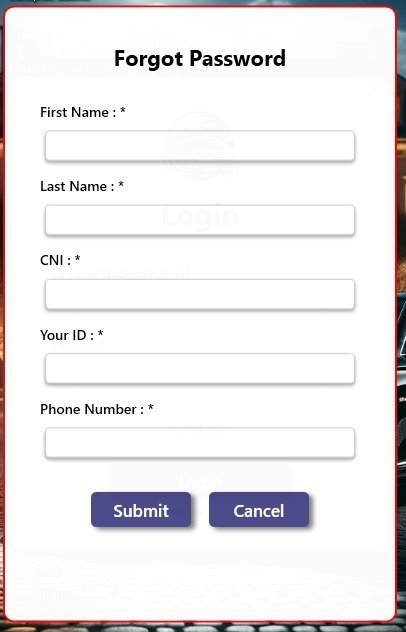

*Figure 23 : forget password*

L'interface de récupération de mot de passe est une partie essentielle de notre application de bureau. Elle aide les utilisateurs à récupérer leur accès s'ils oublient leurs identifiants.
####

1) #### **Les interfaces d’administrateur**
#####
1. ##### **Interface accueil**

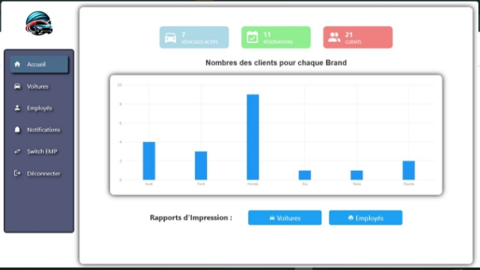

*Figure 24 :  interface d’accueil pour l'administrateur*

L'interface d'accueil pour l'administrateur fournit un aperçu complet des véhicules sortis, des réservations effectuées et du nombre de clients enregistrés dans la base de données. Elle présente des graphiques illustrant le nombre de clients par marque, ainsi que divers indicateurs clés. De plus, elle offre des options pour imprimes des rapports sur les voitures et les employés.

1. ##### **Interface voiture**

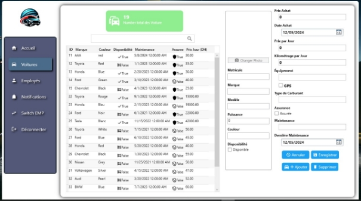

*Figure 25 :  interface des voitures pour l'administrateur*

L'interface des voitures pour l'administrateur affiche le nombre total de véhicules enregistrés dans la base de données. Elle propose également des fonctionnalités permettant d'ajouter une nouvelle voiture, ainsi que de modifier ou supprimer les entrées existantes, facilitant ainsi la gestion complète des voitures.

1. ##### **Interface employée**

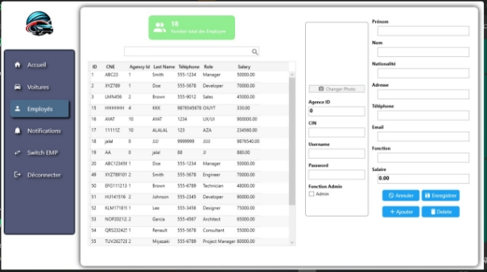

*Figure 26 : interface des employés pour l'administrateur*

L'interface des employés pour l'administrateur affiche le nombre total d'employés enregistrés dans la base de données. Elle propose également des fonctionnalités permettant d'ajouter un nouvel employé, ainsi que de modifier ou supprimer les entrées existantes, facilitant ainsi la gestion complète du personnel.

1. ##### **Interface notification**

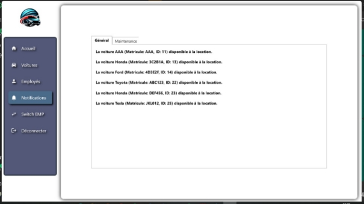

*Figure 27 :  interface de notification pour l'administrateur*

L'interface de notification indique, sous l'onglet "Général", les véhicules disponibles pour la location. Dans l'onglet "Maintenance", elle affiche des alertes pour les véhicules qui requièrent une maintenance. Cette fonctionnalité assure une gestion efficace du parc automobile en offrant des mises à jour en temps réel sur l'état des véhicules, facilitant ainsi l'organisation de la location et de la maintenance des voitures.

1) #### **Les interfaces d’employée**

1. ##### **Interface accueil**

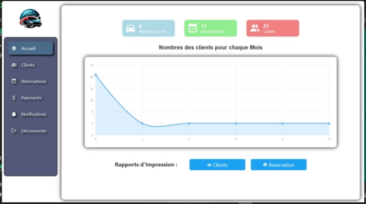

*Figure 28 :  interface d'accueil pour l'employé*

L'interface d'accueil pour l'employé présente un résumé détaillé des réservations effectuées et du total de clients enregistrés dans la base de données. Un graphique y illustre le nombre de clients ayant loué une ou plusieurs voitures chaque mois, accompagné d'autres indicateurs clés. De plus, cette interface offre la possibilité d'imprimer des rapports approfondis sur les clients et les réservations.

1. ##### **Interface client**

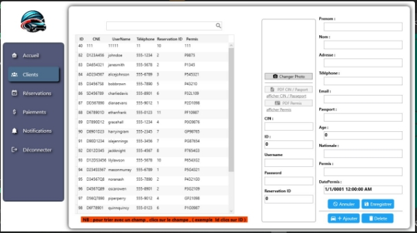

*Figure 29 : interface client pour l'employé*

L'interface client affiche le nombre total de clients enregistrés dans la base de données. Elle offre également des options pour ajouter, modifier ou supprimer des clients, facilitant ainsi la gestion efficace de la clientèle. Cette interface centralise les informations client, améliorant l'organisation et la communication au sein de l'entreprise.

**
1. ##### **Interface réservation**

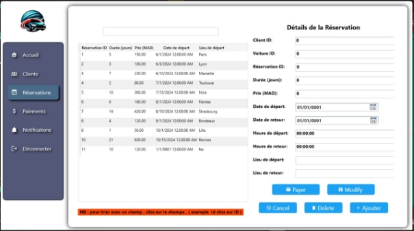

*Figure 30 :  interface de réservation pour l'employé*

L'interface de réservation permet d'ajouter, de modifier ou de supprimer des réservations, simplifiant ainsi leur gestion. Elle centralise toutes les informations relatives aux réservations, ce qui contribue à améliorer l'organisation et la communication dans l'entreprise.

**
1. ##### **Interface paiements**

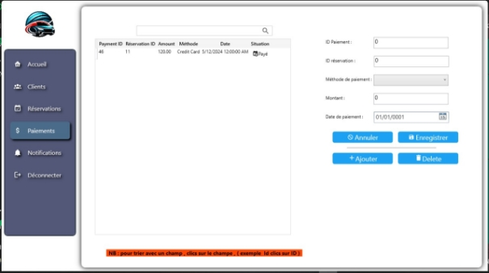

*Figure 31 : interface de paiements pour l'employé*

L'interface de paiements permet d'ajouter, d'enregistrer, ou de supprimer des paiements.

**

1. ##### **Interface notification**

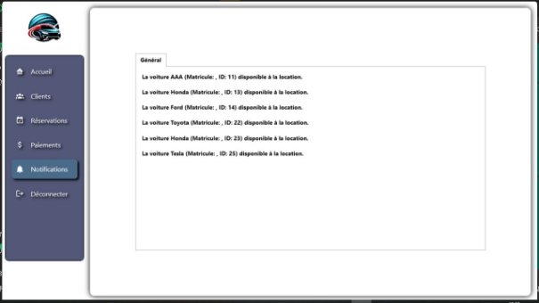

*Figure 32 : interface de notification pour l'employé*

L'interface de notification indique, sous l'onglet "Général", les véhicules disponibles pour la location.

# **Conclusion Générale**

Ce projet constitue une étape cruciale de notre parcours de formation, offrant une excellente opportunité pour mettre en pratique des connaissances théoriques préalablement acquises tout en nous permettant de développer de nouvelles compétences techniques. Pour mener à bien ce projet, nous avons élaboré un plan détaillé, facilitant l'organisation de notre temps limité et optimisant notre efficacité.

Parallèlement, nous avons découvert l'importance cruciale de la recherche et de la communication dans l'accès à des informations pertinentes, ainsi que la gestion du temps et la planification des tâches pour une exécution fluide des travaux. Grâce à un environnement de travail propice et à une coordination efficace, nous avons réussi à achever le projet conformément au cahier des charges, tout en y ajoutant des fonctionnalités supplémentaires pour en augmenter l'efficacité et l'attrait.

Bien que notre projet réponde déjà à tous les besoins énoncés dans le cahier des charges, nous envisageons d'apporter des améliorations futures pour améliorer la performance de l'application.

Les résultats obtenus jusqu'à présent sont prometteurs et nous motivent à poursuivre le développement de ce projet.

# **Webographie**

**MySQL:** <https://www.w3schools.com/>

**MSIX :** <https://youtu.be/4t2TI8ImwMY>

**C# WPF : <https://www.youtube.com/watch?v=t9ivUosw_iI&list=PLih2KERbY1HHOOJ2C6FOrVXIwg4AZ-hk1>**

**WPF MVVM :** 

<https://www.youtube.com/watch?v=fZxZswmC_BY&list=PLA8ZIAm2I03hS41Fy4vFpRw8AdYNBXmNm>

52

